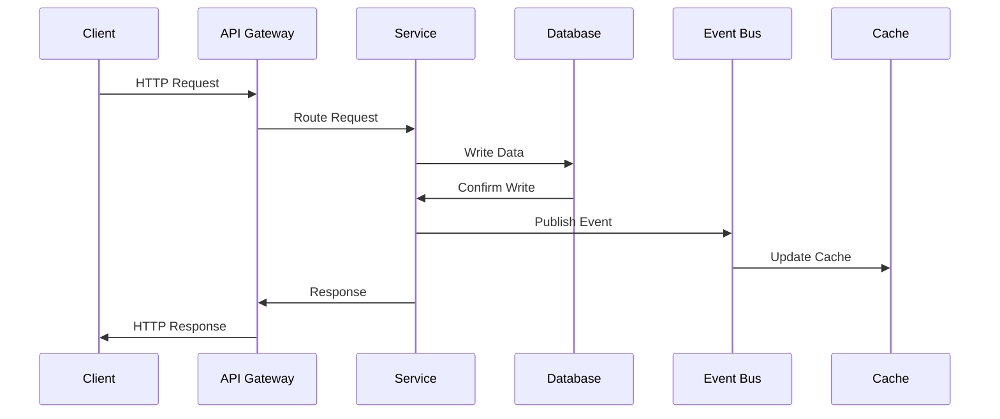
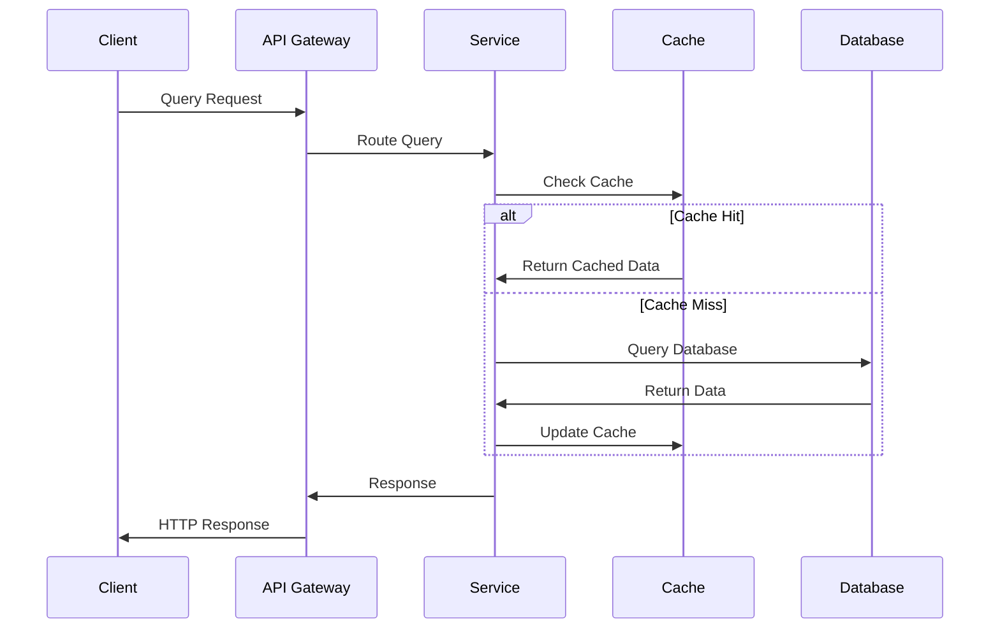
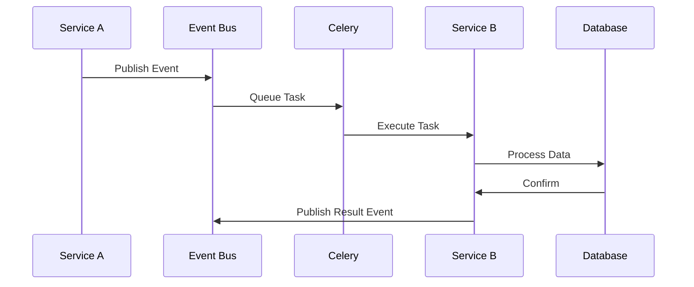

# FlyEsports 系统架构总览

## 目录
- [1. 架构设计理念](#1-架构设计理念)
- [2. 整体架构图](#2-整体架构图)
- [3. 微服务架构分解](#3-微服务架构分解)
- [4. 技术栈选型](#4-技术栈选型)
- [5. 模块间通信机制](#5-模块间通信机制)
- [6. 数据流设计](#6-数据流设计)
- [7. 部署架构](#7-部署架构)

## 1. 架构设计理念

### 1.1 核心原则
- **多租户架构**: 支持多个赛区独立运营，数据完全隔离
- **原子化接口**: 每个API接口只负责单一职责，确保高内聚低耦合
- **事件驱动**: 通过事件驱动架构实现模块间松耦合通信
- **异步优先**: 重计算任务异步处理，保证系统响应性
- **可扩展性**: 支持水平扩展，应对业务增长

### 1.2 设计模式
- **领域驱动设计 (DDD)**: 以业务领域为核心的架构设计
- **清洁架构 (Clean Architecture)**: 四层架构，依赖倒置
- **CQRS模式**: 读写分离，优化查询性能
- **事件溯源**: 关键业务事件的完整记录和回放

## 2. 整体架构图

```
┌─────────────────────────────────────────────────────────────┐
│                        Client Layer                         │
│  ┌─────────────────┐  ┌─────────────────┐  ┌─────────────────┐│
│  │   Web Frontend  │  │  Mobile App     │  │  Admin Panel    ││
│  │   (Vue 3 + TS)  │  │  (React Native) │  │   (Vue 3 + TS)  ││
│  └─────────────────┘  └─────────────────┘  └─────────────────┘│
└─────────────────────────────────────────────────────────────┘
                               │
┌─────────────────────────────────────────────────────────────┐
│                      API Gateway                            │
│            (认证、路由、限流、监控)                             │
└─────────────────────────────────────────────────────────────┘
                               │
┌─────────────────────────────────────────────────────────────┐
│                    Presentation Layer                       │
│  ┌─────────────────┐  ┌─────────────────┐  ┌─────────────────┐│
│  │   User Service  │  │  Region Service │  │  Team Service   ││
│  │   (FastAPI)     │  │   (FastAPI)     │  │   (FastAPI)     ││
│  └─────────────────┘  └─────────────────┘  └─────────────────┘│
│  ┌─────────────────┐  ┌─────────────────┐  ┌─────────────────┐│
│  │  Match Service  │  │ Rating Service  │  │Transfer Service ││
│  │   (FastAPI)     │  │   (FastAPI)     │  │   (FastAPI)     ││
│  └─────────────────┘  └─────────────────┘  └─────────────────┘│
└─────────────────────────────────────────────────────────────┘
                               │
┌─────────────────────────────────────────────────────────────┐
│                   Application Layer                         │
│  ┌─────────────────┐  ┌─────────────────┐  ┌─────────────────┐│
│  │   Use Cases     │  │  Command Bus    │  │   Event Bus     ││
│  │  Orchestration  │  │   Handlers      │  │   Handlers      ││
│  └─────────────────┘  └─────────────────┘  └─────────────────┘│
└─────────────────────────────────────────────────────────────┘
                               │
┌─────────────────────────────────────────────────────────────┐
│                     Domain Layer                            │
│  ┌─────────────────┐  ┌─────────────────┐  ┌─────────────────┐│
│  │   Aggregates    │  │     Entities    │  │ Value Objects   ││
│  │ (Player, Team,  │  │ (PlayerProfile, │  │ (Rating, Rank,  ││
│  │  Region, Match) │  │  User, Season)  │  │  ContractStatus)││
│  └─────────────────┘  └─────────────────┘  └─────────────────┘│
└─────────────────────────────────────────────────────────────┘
                               │
┌─────────────────────────────────────────────────────────────┐
│                 Infrastructure Layer                        │
│  ┌─────────────────┐  ┌─────────────────┐  ┌─────────────────┐│
│  │   PostgreSQL    │  │     Redis       │  │     Celery      ││
│  │   (Main DB)     │  │   (Cache +      │  │  (Async Tasks)  ││
│  │                 │  │   Queues)       │  │                 ││
│  └─────────────────┘  └─────────────────┘  └─────────────────┘│
│  ┌─────────────────┐  ┌─────────────────┐  ┌─────────────────┐│
│  │   TimescaleDB   │  │   External APIs │  │   File Storage  ││
│  │  (Time Series)  │  │  (Riot Games)   │  │     (MinIO)     ││
│  └─────────────────┘  └─────────────────┘  └─────────────────┘│
└─────────────────────────────────────────────────────────────┘
```

## 3. 微服务架构分解

### 3.1 核心业务服务

#### User Service (用户服务)
- **职责**: 用户认证、授权、基础信息管理
- **端口**: 8001
- **数据库**: PostgreSQL (users表)
- **主要API**:
  - `POST /api/v1/users/register`
  - `POST /api/v1/auth/login`
  - `GET /api/v1/users/{user_id}`

#### Player Service (选手服务) 
- **职责**: 选手档案管理、多赛区身份
- **端口**: 8002
- **数据库**: PostgreSQL (player_profiles表)
- **主要API**:
  - `POST /api/v1/profiles`
  - `GET /api/v1/profiles/{profile_id}`
  - `PUT /api/v1/profiles/{profile_id}/rank`

#### Rating Service (评分服务)
- **职责**: ELO评分计算、6维度分析
- **端口**: 8003
- **数据库**: PostgreSQL + TimescaleDB
- **主要API**:
  - `GET /api/v1/ratings/{profile_id}`
  - `POST /api/v1/ratings/calculate`
  - `PUT /api/v1/ratings/{profile_id}/lock`

#### Team Service (战队服务)
- **职责**: 战队管理、阵容配置
- **端口**: 8004  
- **数据库**: PostgreSQL (teams表)
- **主要API**:
  - `POST /api/v1/teams`
  - `GET /api/v1/teams/{team_id}/roster`
  - `POST /api/v1/teams/{team_id}/roster/add`

#### Match Service (比赛服务)
- **职责**: 定价赛管理、比赛结果处理
- **端口**: 8005
- **数据库**: PostgreSQL + TimescaleDB
- **主要API**:
  - `POST /api/v1/pricing-matches`
  - `PUT /api/v1/pricing-matches/{match_id}/end`
  - `POST /api/v1/evaluations`

### 3.2 支撑服务

#### Region Service (赛区服务)
- **职责**: 多租户管理、赛区配置
- **端口**: 8006
- **数据库**: PostgreSQL (regions表)

#### Transfer Service (转会服务)  
- **职责**: 转会管理、锁定解封
- **端口**: 8007
- **数据库**: PostgreSQL (transfers表)

#### Analytics Service (分析服务)
- **职责**: 数据分析、报表生成
- **端口**: 8008
- **数据库**: ClickHouse

#### Notification Service (通知服务)
- **职责**: 消息推送、邮件通知
- **端口**: 8009
- **依赖**: Redis + 第三方服务

## 4. 技术栈选型

### 4.1 后端技术栈

```python
# Web框架
FastAPI 0.104+          # 高性能异步Web框架
Pydantic 2.0+          # 数据验证和序列化
Uvicorn               # ASGI服务器

# 数据库相关
SQLAlchemy 2.0+       # ORM框架
Asyncpg               # PostgreSQL异步驱动
Alembic               # 数据库迁移工具
Redis 7.0+            # 缓存和消息队列
TimescaleDB 2.11+     # 时序数据存储

# 异步任务
Celery 5.3+           # 分布式任务队列
Redis (Broker)        # 消息代理

# 监控和日志
Prometheus            # 指标收集
Grafana               # 监控面板
ELK Stack             # 日志聚合

# 测试工具
Pytest                # 单元测试框架
pytest-asyncio       # 异步测试支持
Factory Boy           # 测试数据工厂
```

### 4.2 前端技术栈

```typescript
// 核心框架
Vue 3.3+              // 前端框架
TypeScript 5.0+       // 类型系统
Vite 4.0+             // 构建工具

// UI组件库
Ant Design Vue 4.0+   // UI组件库
TailwindCSS 3.3+      // CSS框架

// 状态管理
Pinia 2.1+            // 状态管理
VueUse 10.0+          // 组合式工具库

// 开发工具
ESLint                // 代码检查
Prettier              // 代码格式化
Vitest                // 单元测试
Cypress               // E2E测试
```

### 4.3 运维工具

```yaml
# 容器化
Docker 24.0+          # 容器运行时
Docker Compose        # 本地开发编排

# 编排和部署
Kubernetes 1.28+      # 容器编排
Helm 3.12+            # 包管理器

# CI/CD
GitHub Actions        # 持续集成
ArgoCD                # 持续部署

# 监控
Prometheus + Grafana  # 监控告警
ELK Stack             # 日志管理
Jaeger                # 链路追踪
```

## 5. 模块间通信机制

### 5.1 同步通信

#### HTTP REST API
```python
# 服务间HTTP调用示例
class UserServiceClient:
    async def get_user(self, user_id: str) -> UserInfo:
        async with httpx.AsyncClient() as client:
            response = await client.get(
                f"{USER_SERVICE_URL}/api/v1/users/{user_id}",
                headers={"Authorization": f"Bearer {token}"}
            )
            return UserInfo.parse_obj(response.json())
```

#### GraphQL Federation
```graphql
# 联邦GraphQL Schema示例
extend type User @key(fields: "id") {
  id: ID! @external
  playerProfiles: [PlayerProfile!]!
}

extend type PlayerProfile {
  user: User!
  currentRating: Rating!
  team: Team
}
```

### 5.2 异步通信

#### 事件总线
```python
# 领域事件发布
class PlayerService:
    async def update_rating(self, profile_id: str, new_rating: float):
        # 更新评分
        await self.repository.update_rating(profile_id, new_rating)
        
        # 发布事件
        event = PlayerRatingUpdatedEvent(
            profile_id=profile_id,
            old_rating=old_rating,
            new_rating=new_rating,
            timestamp=datetime.utcnow()
        )
        await self.event_bus.publish(event)

# 事件处理
class LeaderboardHandler:
    async def handle_player_rating_updated(
        self, event: PlayerRatingUpdatedEvent
    ):
        await self.update_leaderboard_task.delay(
            event.profile_id, event.new_rating
        )
```

#### 消息队列
```python
# Redis Streams消息队列
class EventStream:
    async def publish_event(self, stream: str, event: dict):
        await self.redis.xadd(stream, event)
    
    async def consume_events(self, stream: str, group: str):
        await self.redis.xgroup_create(stream, group, id='0', mkstream=True)
        while True:
            messages = await self.redis.xreadgroup(
                group, 'consumer', {stream: '>'}, count=10, block=1000
            )
            for stream_name, events in messages:
                for event_id, fields in events:
                    await self.process_event(fields)
                    await self.redis.xack(stream, group, event_id)
```

## 6. 数据流设计

### 6.1 写入流程



### 6.2 读取流程



### 6.3 异步处理流程



## 7. 部署架构

### 7.1 Kubernetes部署

```yaml
# 服务部署示例
apiVersion: apps/v1
kind: Deployment
metadata:
  name: user-service
  labels:
    app: user-service
spec:
  replicas: 3
  selector:
    matchLabels:
      app: user-service
  template:
    metadata:
      labels:
        app: user-service
    spec:
      containers:
      - name: user-service
        image: flyesports/user-service:latest
        ports:
        - containerPort: 8001
        env:
        - name: DATABASE_URL
          valueFrom:
            secretKeyRef:
              name: db-secret
              key: url
        - name: REDIS_URL
          valueFrom:
            configMapKeyRef:
              name: redis-config
              key: url
        resources:
          requests:
            memory: "256Mi"
            cpu: "250m"
          limits:
            memory: "512Mi" 
            cpu: "500m"
        livenessProbe:
          httpGet:
            path: /health
            port: 8001
          initialDelaySeconds: 30
          periodSeconds: 10
        readinessProbe:
          httpGet:
            path: /ready
            port: 8001
          initialDelaySeconds: 5
          periodSeconds: 5
---
apiVersion: v1
kind: Service
metadata:
  name: user-service
spec:
  selector:
    app: user-service
  ports:
  - port: 80
    targetPort: 8001
  type: ClusterIP
```

### 7.2 环境配置

```yaml
# 开发环境
environments:
  development:
    replicas: 1
    resources:
      requests:
        memory: "128Mi"
        cpu: "100m"
    database:
      host: "localhost"
      name: "flyesports_dev"
    
# 测试环境  
  staging:
    replicas: 2
    resources:
      requests:
        memory: "256Mi"
        cpu: "200m"
    database:
      host: "staging-db.internal"
      name: "flyesports_staging"

# 生产环境
  production:
    replicas: 5
    resources:
      requests:
        memory: "512Mi"
        cpu: "500m"
    database:
      host: "prod-db-cluster.internal"
      name: "flyesports_prod"
```

### 7.3 负载均衡

```nginx
# Nginx配置示例
upstream user_service {
    least_conn;
    server user-service-1:8001;
    server user-service-2:8001;
    server user-service-3:8001;
}

upstream rating_service {
    least_conn;
    server rating-service-1:8003;
    server rating-service-2:8003;
}

server {
    listen 80;
    server_name api.flyesports.com;

    location /api/v1/users/ {
        proxy_pass http://user_service;
        proxy_set_header Host $host;
        proxy_set_header X-Real-IP $remote_addr;
        proxy_set_header X-Forwarded-For $proxy_add_x_forwarded_for;
    }

    location /api/v1/ratings/ {
        proxy_pass http://rating_service;
        proxy_set_header Host $host;
        proxy_set_header X-Real-IP $remote_addr;
        proxy_set_header X-Forwarded-For $proxy_add_x_forwarded_for;
    }
}
```

## 总结

FlyEsports采用了现代化的微服务架构，通过DDD+清洁架构确保了系统的可维护性和可扩展性。原子化的接口设计和事件驱动的通信机制保证了各模块间的低耦合，为未来的功能扩展奠定了坚实基础。

通过合理的技术栈选型和部署架构，系统能够支持大规模并发访问，同时保证高可用性和性能表现。