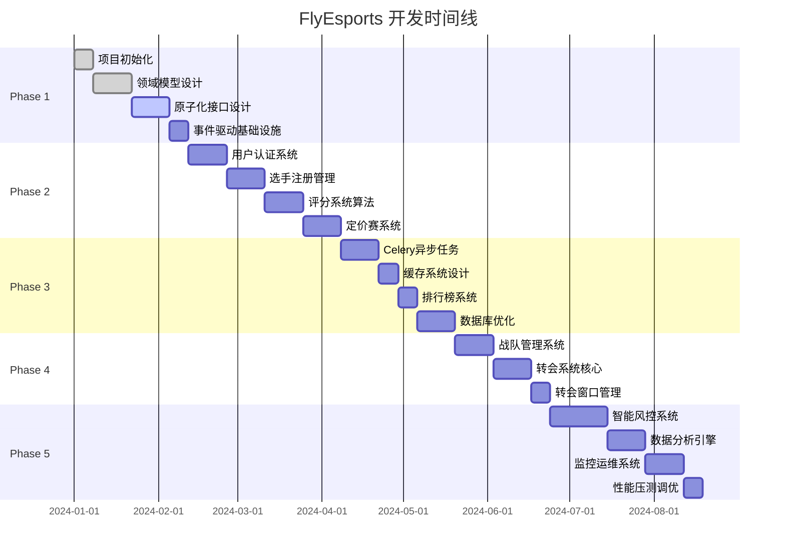

# FlyEsports 详细开发路线图

## 目录
- [1. 项目概述](#1-项目概述)
- [2. 开发阶段划分](#2-开发阶段划分)
- [3. Phase 1: 基础架构与原子化接口设计](#3-phase-1-基础架构与原子化接口设计)
- [4. Phase 2: 核心业务逻辑实现](#4-phase-2-核心业务逻辑实现)
- [5. Phase 3: 异步处理与性能优化](#5-phase-3-异步处理与性能优化)
- [6. Phase 4: 转会与战队管理](#6-phase-4-转会与战队管理)
- [7. Phase 5: 高级特性与优化](#7-phase-5-高级特性与优化)
- [8. 质量保证体系](#8-质量保证体系)
- [9. 风险管理](#9-风险管理)
- [10. 资源配置](#10-资源配置)

## 1. 项目概述

### 1.1 项目目标
构建一个企业级的电竞选手管理和定价系统，支持多赛区运营，实现从传统"QQ群+Excel"模式向专业化平台的升级。

### 1.2 核心指标
- **性能指标**: 支持10万+并发用户，API响应时间<200ms
- **可用性**: 99.9%系统可用性
- **可扩展性**: 支持100+赛区独立运营
- **安全性**: 企业级安全防护

### 1.3 交付方式
- **迭代周期**: 2周一个Sprint
- **发布频率**: 每月至少一次生产发布
- **质量标准**: 代码覆盖率>90%，所有PR必须经过Code Review

## 2. 开发阶段划分



## 3. Phase 1: 基础架构与原子化接口设计 (4-6周)

### 3.1 Week 1: 项目初始化

#### 3.1.1 开发环境搭建
**负责人**: DevOps团队  
**工作内容**:
- [ ] 创建FastAPI项目模板
- [ ] 配置Docker开发环境
- [ ] 设置PostgreSQL + Redis集群
- [ ] 建立代码质量检查工具链

**可交付物**:
```
flyesports/
├── backend/
│   ├── src/
│   │   ├── domain/          # 领域层
│   │   ├── application/     # 应用层
│   │   ├── infrastructure/  # 基础设施层
│   │   └── presentation/    # 表现层
│   ├── tests/
│   ├── Dockerfile
│   └── requirements.txt
├── frontend/
│   ├── src/
│   ├── package.json
│   └── Dockerfile
├── docker-compose.yml
├── .github/workflows/       # CI/CD配置
└── README.md
```

**验收标准**:
- Docker环境一键启动成功
- 所有质量检查工具配置完成
- CI/CD基础流水线运行成功

#### 3.1.2 基础配置管理
**工作内容**:
- [ ] 环境变量配置系统
- [ ] 日志系统配置
- [ ] 错误处理中间件
- [ ] 健康检查端点

**代码示例**:
```python
# src/core/config.py
from pydantic import BaseSettings

class Settings(BaseSettings):
    # 数据库配置
    DATABASE_URL: str
    REDIS_URL: str
    
    # JWT配置
    SECRET_KEY: str
    ALGORITHM: str = "HS256"
    ACCESS_TOKEN_EXPIRE_MINUTES: int = 30
    
    # Celery配置
    CELERY_BROKER_URL: str
    CELERY_RESULT_BACKEND: str
    
    # 外部API配置
    RIOT_API_KEY: str
    RIOT_API_URL: str = "https://api.riotgames.com"
    
    class Config:
        env_file = ".env"

settings = Settings()
```

### 3.2 Week 2-3: 领域模型设计

#### 3.2.1 核心聚合根设计
**负责人**: 架构师 + 后端Team Lead  
**工作内容**:
- [ ] User聚合根实现
- [ ] PlayerProfile聚合根实现
- [ ] Region聚合根实现
- [ ] Team聚合根实现

**代码示例**:
```python
# src/domain/aggregates/player_profile.py
from dataclasses import dataclass
from typing import Optional, List
from datetime import datetime
from ..entities.base import AggregateRoot
from ..value_objects.rating import Rating
from ..value_objects.rank_info import RankInfo
from ..events.player_events import PlayerRatingUpdatedEvent

@dataclass
class PlayerProfile(AggregateRoot):
    profile_id: str
    user_id: str
    region_id: str
    player_name: str
    rank_info: RankInfo
    rating: Rating
    contract_status: str  # FREE, LOCKED, SUSPENDED
    position: str
    created_at: datetime
    updated_at: datetime
    
    def update_rating(self, new_rating: float, reason: str):
        """更新选手评分"""
        old_rating = self.rating.current_score
        self.rating.update_score(new_rating)
        self.updated_at = datetime.utcnow()
        
        # 发布领域事件
        event = PlayerRatingUpdatedEvent(
            profile_id=self.profile_id,
            old_rating=old_rating,
            new_rating=new_rating,
            reason=reason,
            timestamp=self.updated_at
        )
        self.add_domain_event(event)
    
    def lock_rating(self, team_id: str) -> float:
        """锁定评分（签约时）"""
        if self.contract_status != "FREE":
            raise ValueError("Player is not available for signing")
        
        locked_score = self.rating.current_score
        self.contract_status = "LOCKED"
        self.rating.lock_score(locked_score)
        self.updated_at = datetime.utcnow()
        
        return locked_score
    
    def unlock_rating(self):
        """解锁评分（解约时）"""
        self.contract_status = "FREE"
        self.rating.unlock_score()
        self.updated_at = datetime.utcnow()
```

#### 3.2.2 值对象实现
**工作内容**:
- [ ] Rating值对象
- [ ] RankInfo值对象
- [ ] ContractStatus枚举
- [ ] Position枚举

**代码示例**:
```python
# src/domain/value_objects/rating.py
from dataclasses import dataclass
from typing import Optional

@dataclass(frozen=True)
class Rating:
    current_score: float
    locked_score: Optional[float]
    confidence_level: float
    total_matches: int
    six_dimensions: dict
    
    def __post_init__(self):
        if not (0 <= self.current_score <= 100):
            raise ValueError("Rating must be between 0 and 100")
        if not (0.5 <= self.confidence_level <= 0.95):
            raise ValueError("Confidence must be between 0.5 and 0.95")
    
    def update_score(self, new_score: float) -> 'Rating':
        """创建新的Rating对象（值对象不可变）"""
        return Rating(
            current_score=new_score,
            locked_score=self.locked_score,
            confidence_level=self.confidence_level,
            total_matches=self.total_matches + 1,
            six_dimensions=self.six_dimensions
        )
    
    def lock_score(self, locked_value: float) -> 'Rating':
        """锁定评分"""
        return Rating(
            current_score=self.current_score,
            locked_score=locked_value,
            confidence_level=self.confidence_level,
            total_matches=self.total_matches,
            six_dimensions=self.six_dimensions
        )
```

#### 3.2.3 领域事件设计
**工作内容**:
- [ ] 基础事件类
- [ ] 用户相关事件
- [ ] 选手相关事件
- [ ] 评分相关事件

**代码示例**:
```python
# src/domain/events/base.py
from abc import ABC
from dataclasses import dataclass
from datetime import datetime
from typing import Dict, Any
import uuid

@dataclass
class DomainEvent(ABC):
    event_id: str = None
    timestamp: datetime = None
    
    def __post_init__(self):
        if self.event_id is None:
            self.event_id = str(uuid.uuid4())
        if self.timestamp is None:
            self.timestamp = datetime.utcnow()
    
    def to_dict(self) -> Dict[str, Any]:
        return {
            "event_id": self.event_id,
            "event_type": self.__class__.__name__,
            "timestamp": self.timestamp.isoformat(),
            "data": self.__dict__
        }

# src/domain/events/player_events.py
@dataclass
class PlayerRegisteredEvent(DomainEvent):
    profile_id: str
    user_id: str
    region_id: str
    player_name: str
    initial_rating: float

@dataclass
class PlayerRatingUpdatedEvent(DomainEvent):
    profile_id: str
    old_rating: float
    new_rating: float
    reason: str
```

### 3.3 Week 4-5: 原子化接口设计

#### 3.3.1 API设计原则
**设计标准**:
- 每个API只负责单一职责
- 统一的错误处理格式
- 标准化的请求/响应结构
- 完整的参数验证

#### 3.3.2 用户管理API
**工作内容**:
- [ ] 用户注册接口
- [ ] 用户认证接口
- [ ] 用户信息管理接口

**API规范**:
```python
# src/presentation/api/routes/users.py
from fastapi import APIRouter, Depends, HTTPException, status
from ...schemas.users import UserCreateRequest, UserResponse, UserUpdateRequest
from ...dependencies.auth import get_current_user

router = APIRouter(prefix="/api/v1/users", tags=["users"])

@router.post("/", response_model=UserResponse, status_code=status.HTTP_201_CREATED)
async def create_user(
    request: UserCreateRequest,
    user_service: UserService = Depends(get_user_service)
) -> UserResponse:
    """创建新用户"""
    try:
        user = await user_service.create_user(request)
        return UserResponse.from_domain(user)
    except EmailAlreadyExistsError:
        raise HTTPException(
            status_code=status.HTTP_409_CONFLICT,
            detail="Email already registered"
        )

@router.get("/{user_id}", response_model=UserResponse)
async def get_user(
    user_id: str,
    current_user: User = Depends(get_current_user),
    user_service: UserService = Depends(get_user_service)
) -> UserResponse:
    """获取用户详情"""
    # 权限检查
    if current_user.user_id != user_id and not current_user.is_admin:
        raise HTTPException(
            status_code=status.HTTP_403_FORBIDDEN,
            detail="Access denied"
        )
    
    user = await user_service.get_user(user_id)
    if not user:
        raise HTTPException(
            status_code=status.HTTP_404_NOT_FOUND,
            detail="User not found"
        )
    
    return UserResponse.from_domain(user)

@router.put("/{user_id}/profile", response_model=UserResponse)
async def update_user_profile(
    user_id: str,
    request: UserUpdateRequest,
    current_user: User = Depends(get_current_user),
    user_service: UserService = Depends(get_user_service)
) -> UserResponse:
    """更新用户资料"""
    if current_user.user_id != user_id:
        raise HTTPException(
            status_code=status.HTTP_403_FORBIDDEN,
            detail="Can only update own profile"
        )
    
    updated_user = await user_service.update_user(user_id, request)
    return UserResponse.from_domain(updated_user)
```

#### 3.3.3 选手档案API
**工作内容**:
- [ ] 选手注册接口
- [ ] 档案查询接口
- [ ] 档案更新接口
- [ ] 状态管理接口

**API规范**:
```python
# src/presentation/api/routes/players.py
@router.post("/profiles", response_model=PlayerProfileResponse)
async def create_player_profile(
    request: PlayerProfileCreateRequest,
    current_user: User = Depends(get_current_user),
    player_service: PlayerService = Depends(get_player_service)
) -> PlayerProfileResponse:
    """创建选手档案"""
    # 验证用户是否已在该赛区注册
    existing_profile = await player_service.get_profile_by_user_region(
        current_user.user_id, request.region_id
    )
    if existing_profile:
        raise HTTPException(
            status_code=status.HTTP_409_CONFLICT,
            detail="Already registered in this region"
        )
    
    profile = await player_service.create_profile(current_user.user_id, request)
    return PlayerProfileResponse.from_domain(profile)

@router.get("/profiles/{profile_id}", response_model=PlayerProfileResponse)
async def get_player_profile(
    profile_id: str,
    player_service: PlayerService = Depends(get_player_service)
) -> PlayerProfileResponse:
    """获取选手档案详情"""
    profile = await player_service.get_profile(profile_id)
    if not profile:
        raise HTTPException(
            status_code=status.HTTP_404_NOT_FOUND,
            detail="Player profile not found"
        )
    
    return PlayerProfileResponse.from_domain(profile)

@router.put("/profiles/{profile_id}/rank", response_model=PlayerProfileResponse)
async def update_player_rank(
    profile_id: str,
    request: RankUpdateRequest,
    current_user: User = Depends(get_current_user),
    player_service: PlayerService = Depends(get_player_service)
) -> PlayerProfileResponse:
    """更新选手段位信息"""
    # 权限验证
    profile = await player_service.get_profile(profile_id)
    if profile.user_id != current_user.user_id:
        raise HTTPException(
            status_code=status.HTTP_403_FORBIDDEN,
            detail="Can only update own profile"
        )
    
    updated_profile = await player_service.update_rank(profile_id, request.rank_info)
    return PlayerProfileResponse.from_domain(updated_profile)
```

### 3.4 Week 6: 事件驱动基础设施

#### 3.4.1 事件总线实现
**工作内容**:
- [ ] 内存事件总线
- [ ] Redis事件总线
- [ ] 事件持久化机制

**代码示例**:
```python
# src/infrastructure/events/event_bus.py
from abc import ABC, abstractmethod
from typing import List, Callable, Dict, Type
import asyncio
import json
from ...domain.events.base import DomainEvent

class EventBus(ABC):
    @abstractmethod
    async def publish(self, event: DomainEvent) -> None:
        pass
    
    @abstractmethod
    async def subscribe(self, event_type: Type[DomainEvent], handler: Callable) -> None:
        pass

class RedisEventBus(EventBus):
    def __init__(self, redis_client):
        self.redis = redis_client
        self.handlers: Dict[str, List[Callable]] = {}
    
    async def publish(self, event: DomainEvent) -> None:
        """发布事件到Redis Stream"""
        event_data = event.to_dict()
        stream_name = f"events:{event.__class__.__name__}"
        
        await self.redis.xadd(stream_name, event_data)
    
    async def subscribe(self, event_type: Type[DomainEvent], handler: Callable) -> None:
        """订阅事件处理器"""
        event_name = event_type.__name__
        if event_name not in self.handlers:
            self.handlers[event_name] = []
        self.handlers[event_name].append(handler)
    
    async def start_consuming(self):
        """开始消费事件"""
        for event_name, handlers in self.handlers.items():
            stream_name = f"events:{event_name}"
            asyncio.create_task(self._consume_stream(stream_name, handlers))
    
    async def _consume_stream(self, stream_name: str, handlers: List[Callable]):
        """消费指定流的事件"""
        group_name = f"handlers_{stream_name}"
        
        try:
            await self.redis.xgroup_create(stream_name, group_name, id='0', mkstream=True)
        except:
            pass  # Group already exists
        
        while True:
            try:
                messages = await self.redis.xreadgroup(
                    group_name, 'consumer', {stream_name: '>'}, count=10, block=1000
                )
                
                for stream, events in messages:
                    for event_id, fields in events:
                        for handler in handlers:
                            try:
                                await handler(fields)
                            except Exception as e:
                                # 错误处理和重试逻辑
                                print(f"Handler error: {e}")
                        
                        await self.redis.xack(stream_name, group_name, event_id)
            except Exception as e:
                print(f"Consumer error: {e}")
                await asyncio.sleep(1)
```

#### 3.4.2 事件存储实现
**工作内容**:
- [ ] 事件存储接口
- [ ] PostgreSQL事件存储
- [ ] 事件重播功能

**代码示例**:
```python
# src/infrastructure/events/event_store.py
from typing import List, Optional
from datetime import datetime
import json

class EventStore:
    def __init__(self, db_session):
        self.db = db_session
    
    async def append_events(self, stream_id: str, events: List[DomainEvent], expected_version: int = -1):
        """追加事件到流"""
        current_version = await self.get_stream_version(stream_id)
        
        if expected_version != -1 and current_version != expected_version:
            raise ConcurrencyError(f"Expected version {expected_version}, got {current_version}")
        
        for i, event in enumerate(events):
            event_record = EventRecord(
                stream_id=stream_id,
                event_id=event.event_id,
                event_type=event.__class__.__name__,
                event_data=json.dumps(event.to_dict()),
                version=current_version + i + 1,
                created_at=event.timestamp
            )
            self.db.add(event_record)
        
        await self.db.commit()
    
    async def read_events(self, stream_id: str, from_version: int = 1) -> List[DomainEvent]:
        """读取流中的事件"""
        query = select(EventRecord).where(
            EventRecord.stream_id == stream_id,
            EventRecord.version >= from_version
        ).order_by(EventRecord.version)
        
        result = await self.db.execute(query)
        event_records = result.scalars().all()
        
        events = []
        for record in event_records:
            event_data = json.loads(record.event_data)
            event_class = self._get_event_class(record.event_type)
            event = event_class(**event_data['data'])
            events.append(event)
        
        return events
    
    async def get_stream_version(self, stream_id: str) -> int:
        """获取流的当前版本"""
        query = select(func.max(EventRecord.version)).where(
            EventRecord.stream_id == stream_id
        )
        result = await self.db.execute(query)
        version = result.scalar()
        return version or 0
```

## 4. Phase 2: 核心业务逻辑实现 (6-8周)

### 4.1 Week 7-8: 用户认证与授权系统

#### 4.1.1 JWT认证实现
**负责人**: 安全专家 + 后端开发  
**工作内容**:
- [ ] JWT Token生成和验证
- [ ] Refresh Token机制
- [ ] 用户权限管理
- [ ] 多租户权限隔离

**代码示例**:
```python
# src/infrastructure/services/jwt_service.py
from datetime import datetime, timedelta
import jwt
from typing import Optional, Dict, Any

class JWTService:
    def __init__(self, secret_key: str, algorithm: str = "HS256"):
        self.secret_key = secret_key
        self.algorithm = algorithm
        self.access_token_expire_minutes = 30
        self.refresh_token_expire_days = 30
    
    def create_access_token(self, user_id: str, regions: List[str], permissions: List[str]) -> str:
        """创建访问令牌"""
        expire = datetime.utcnow() + timedelta(minutes=self.access_token_expire_minutes)
        payload = {
            "user_id": user_id,
            "regions": regions,
            "permissions": permissions,
            "token_type": "access",
            "exp": expire,
            "iat": datetime.utcnow()
        }
        return jwt.encode(payload, self.secret_key, algorithm=self.algorithm)
    
    def create_refresh_token(self, user_id: str) -> str:
        """创建刷新令牌"""
        expire = datetime.utcnow() + timedelta(days=self.refresh_token_expire_days)
        payload = {
            "user_id": user_id,
            "token_type": "refresh", 
            "exp": expire,
            "iat": datetime.utcnow()
        }
        return jwt.encode(payload, self.secret_key, algorithm=self.algorithm)
    
    def verify_token(self, token: str) -> Optional[Dict[str, Any]]:
        """验证令牌"""
        try:
            payload = jwt.decode(token, self.secret_key, algorithms=[self.algorithm])
            return payload
        except jwt.ExpiredSignatureError:
            return None
        except jwt.InvalidTokenError:
            return None
```

#### 4.1.2 权限管理系统
**工作内容**:
- [ ] RBAC权限模型
- [ ] 权限装饰器
- [ ] 赛区权限隔离
- [ ] 管理员权限控制

**代码示例**:
```python
# src/presentation/dependencies/auth.py
from fastapi import Depends, HTTPException, status
from fastapi.security import HTTPBearer, HTTPAuthorizationCredentials

security = HTTPBearer()

async def get_current_user(
    credentials: HTTPAuthorizationCredentials = Depends(security),
    jwt_service: JWTService = Depends(get_jwt_service),
    user_service: UserService = Depends(get_user_service)
) -> User:
    """获取当前用户"""
    payload = jwt_service.verify_token(credentials.credentials)
    if not payload:
        raise HTTPException(
            status_code=status.HTTP_401_UNAUTHORIZED,
            detail="Invalid or expired token"
        )
    
    user = await user_service.get_user(payload["user_id"])
    if not user:
        raise HTTPException(
            status_code=status.HTTP_401_UNAUTHORIZED,
            detail="User not found"
        )
    
    return user

def require_permissions(required_permissions: List[str]):
    """权限检查装饰器"""
    def decorator(func):
        async def wrapper(*args, **kwargs):
            current_user = kwargs.get('current_user')
            if not current_user:
                raise HTTPException(
                    status_code=status.HTTP_403_FORBIDDEN,
                    detail="Authentication required"
                )
            
            user_permissions = await get_user_permissions(current_user.user_id)
            if not all(perm in user_permissions for perm in required_permissions):
                raise HTTPException(
                    status_code=status.HTTP_403_FORBIDDEN,
                    detail="Insufficient permissions"
                )
            
            return await func(*args, **kwargs)
        return wrapper
    return decorator

def require_region_access(region_id_param: str):
    """赛区访问权限检查"""
    def decorator(func):
        async def wrapper(*args, **kwargs):
            current_user = kwargs.get('current_user')
            region_id = kwargs.get(region_id_param)
            
            if not await check_region_access(current_user.user_id, region_id):
                raise HTTPException(
                    status_code=status.HTTP_403_FORBIDDEN,
                    detail="No access to this region"
                )
            
            return await func(*args, **kwargs)
        return wrapper
    return decorator
```

### 4.2 Week 9-10: 选手注册与档案管理

#### 4.2.1 多赛区注册系统
**工作内容**:
- [ ] 选手注册流程
- [ ] 段位验证机制
- [ ] 档案状态管理
- [ ] 重复注册检查

**代码示例**:
```python
# src/application/use_cases/player_registration.py
from typing import Optional
from ..commands.player_commands import RegisterPlayerCommand
from ...domain.aggregates.player_profile import PlayerProfile
from ...domain.value_objects.rating import Rating
from ...domain.value_objects.rank_info import RankInfo

class PlayerRegistrationUseCase:
    def __init__(
        self,
        player_repository: PlayerRepository,
        user_repository: UserRepository,
        region_repository: RegionRepository,
        rating_calculator: RatingCalculatorService,
        riot_api_service: RiotAPIService,
        event_bus: EventBus
    ):
        self.player_repo = player_repository
        self.user_repo = user_repository
        self.region_repo = region_repository
        self.rating_calculator = rating_calculator
        self.riot_api = riot_api_service
        self.event_bus = event_bus
    
    async def execute(self, command: RegisterPlayerCommand) -> PlayerProfile:
        """执行选手注册"""
        # 1. 验证用户存在
        user = await self.user_repo.get_by_id(command.user_id)
        if not user:
            raise UserNotFoundError("User not found")
        
        # 2. 验证赛区存在
        region = await self.region_repo.get_by_id(command.region_id)
        if not region:
            raise RegionNotFoundError("Region not found")
        
        # 3. 检查是否已在该赛区注册
        existing_profile = await self.player_repo.get_by_user_region(
            command.user_id, command.region_id
        )
        if existing_profile:
            raise DuplicateRegistrationError("Already registered in this region")
        
        # 4. 验证Riot账号
        riot_account = await self.riot_api.get_summoner_info(
            command.summoner_name, command.region_id
        )
        if not riot_account:
            raise InvalidSummonerError("Summoner not found")
        
        # 5. 获取段位信息
        rank_info = await self.riot_api.get_rank_info(
            riot_account.summoner_id, command.region_id
        )
        
        # 6. 计算初始评分
        initial_rating = await self.rating_calculator.calculate_initial_rating(
            rank_info, command.position, command.region_id
        )
        
        # 7. 创建选手档案
        profile = PlayerProfile.create(
            user_id=command.user_id,
            region_id=command.region_id,
            player_name=command.player_name,
            summoner_name=command.summoner_name,
            rank_info=RankInfo.from_riot_data(rank_info),
            rating=Rating.create_initial(initial_rating),
            position=command.position
        )
        
        # 8. 保存到数据库
        await self.player_repo.save(profile)
        
        # 9. 发布事件
        for event in profile.domain_events:
            await self.event_bus.publish(event)
        profile.clear_domain_events()
        
        return profile
```

#### 4.2.2 档案验证系统
**工作内容**:
- [ ] Riot API集成
- [ ] 段位数据同步
- [ ] 账号绑定验证
- [ ] 数据一致性检查

**代码示例**:
```python
# src/infrastructure/external_apis/riot_api_service.py
import httpx
from typing import Optional, Dict, Any
from ...domain.value_objects.rank_info import RankInfo

class RiotAPIService:
    def __init__(self, api_key: str, base_url: str):
        self.api_key = api_key
        self.base_url = base_url
        self.client = httpx.AsyncClient(
            headers={"X-Riot-Token": api_key},
            timeout=30.0
        )
    
    async def get_summoner_info(self, summoner_name: str, region: str) -> Optional[Dict[str, Any]]:
        """获取召唤师基础信息"""
        url = f"{self.base_url}/lol/summoner/v4/summoners/by-name/{summoner_name}"
        
        try:
            response = await self.client.get(url)
            if response.status_code == 200:
                return response.json()
            elif response.status_code == 404:
                return None
            else:
                raise RiotAPIError(f"API Error: {response.status_code}")
        except httpx.RequestError as e:
            raise RiotAPIError(f"Request failed: {e}")
    
    async def get_rank_info(self, summoner_id: str, region: str) -> Optional[RankInfo]:
        """获取排位信息"""
        url = f"{self.base_url}/lol/league/v4/entries/by-summoner/{summoner_id}"
        
        try:
            response = await self.client.get(url)
            if response.status_code != 200:
                return None
            
            entries = response.json()
            # 查找单双排位信息
            solo_queue = next(
                (entry for entry in entries if entry["queueType"] == "RANKED_SOLO_5x5"),
                None
            )
            
            if solo_queue:
                return RankInfo(
                    tier=solo_queue["tier"],
                    rank=solo_queue["rank"],
                    league_points=solo_queue["leaguePoints"],
                    wins=solo_queue["wins"],
                    losses=solo_queue["losses"],
                    queue_type="RANKED_SOLO_5x5"
                )
            
            return None
        except httpx.RequestError as e:
            raise RiotAPIError(f"Request failed: {e}")
    
    async def verify_summoner_ownership(self, summoner_name: str, verification_code: str) -> bool:
        """验证召唤师所有权（通过第三方代码验证）"""
        # 这里可以通过让用户设置召唤师签名或使用其他验证方式
        summoner = await self.get_summoner_info(summoner_name, "kr")
        if not summoner:
            return False
        
        # 检查召唤师图标或签名中是否包含验证码
        # 具体实现取决于验证方式
        return True
```

### 4.3 Week 11-12: 评分系统核心算法

#### 4.3.1 动态ELO算法实现
**工作内容**:
- [ ] 基础ELO计算
- [ ] K因子动态调整
- [ ] 置信度管理
- [ ] 历史评分追踪

**代码示例**:
```python
# src/domain/services/rating_calculator_service.py
import math
from typing import List, Dict, Any
from ..value_objects.rating import Rating
from ..value_objects.rank_info import RankInfo

class RatingCalculatorService:
    def __init__(self):
        self.base_rating = 50.0
        self.min_rating = 0.0
        self.max_rating = 100.0
        self.base_confidence = 0.5
        self.max_confidence = 0.95
        self.confidence_growth_rate = 0.02
    
    async def calculate_initial_rating(
        self, 
        rank_info: RankInfo, 
        position: str, 
        region_id: str
    ) -> Rating:
        """计算初始评分"""
        # 基于段位的基础分数
        tier_scores = {
            "IRON": 10, "BRONZE": 20, "SILVER": 30, "GOLD": 40,
            "PLATINUM": 50, "DIAMOND": 65, "MASTER": 75,
            "GRANDMASTER": 85, "CHALLENGER": 95
        }
        
        rank_scores = {"IV": -2, "III": -1, "II": 0, "I": 1}
        
        base_score = tier_scores.get(rank_info.tier, 30)
        rank_bonus = rank_scores.get(rank_info.rank, 0)
        
        # LP调整（在段位内的位置）
        if rank_info.tier not in ["MASTER", "GRANDMASTER", "CHALLENGER"]:
            lp_ratio = rank_info.league_points / 100.0
            lp_adjustment = lp_ratio * 3  # 最多3分的LP调整
        else:
            # 高端局特殊处理
            lp_adjustment = min(rank_info.league_points / 1000.0 * 10, 10)
        
        # 胜率调整
        total_games = rank_info.wins + rank_info.losses
        if total_games > 0:
            win_rate = rank_info.wins / total_games
            wr_adjustment = (win_rate - 0.5) * 10  # 胜率偏差调整
        else:
            wr_adjustment = 0
        
        initial_score = base_score + rank_bonus + lp_adjustment + wr_adjustment
        initial_score = max(self.min_rating, min(initial_score, self.max_rating))
        
        return Rating(
            current_score=initial_score,
            locked_score=None,
            confidence_level=self.base_confidence,
            total_matches=0,
            six_dimensions=self._calculate_initial_dimensions(rank_info, position)
        )
    
    async def calculate_elo_update(
        self,
        player_rating: Rating,
        opponent_ratings: List[Rating],
        match_result: float,  # 1.0 = win, 0.0 = loss
        match_performance: Dict[str, Any]
    ) -> Rating:
        """计算ELO评分更新"""
        # 计算期望得分
        expected_score = self._calculate_expected_score(player_rating, opponent_ratings)
        
        # 动态K因子
        k_factor = self._calculate_k_factor(player_rating)
        
        # 基础ELO更新
        rating_change = k_factor * (match_result - expected_score)
        
        # 6维度性能调整
        performance_adjustment = self._calculate_performance_adjustment(
            match_performance, player_rating.six_dimensions
        )
        
        # 最终评分变化
        total_change = rating_change + performance_adjustment
        new_score = player_rating.current_score + total_change
        new_score = max(self.min_rating, min(new_score, self.max_rating))
        
        # 更新置信度
        new_confidence = min(
            player_rating.confidence_level + self.confidence_growth_rate,
            self.max_confidence
        )
        
        # 更新6维度评分
        new_dimensions = self._update_dimensions(
            player_rating.six_dimensions, match_performance
        )
        
        return Rating(
            current_score=new_score,
            locked_score=player_rating.locked_score,
            confidence_level=new_confidence,
            total_matches=player_rating.total_matches + 1,
            six_dimensions=new_dimensions
        )
    
    def _calculate_expected_score(self, player_rating: Rating, opponent_ratings: List[Rating]) -> float:
        """计算期望得分"""
        if not opponent_ratings:
            return 0.5
        
        avg_opponent_rating = sum(r.current_score for r in opponent_ratings) / len(opponent_ratings)
        rating_diff = player_rating.current_score - avg_opponent_rating
        
        # 标准ELO期望公式
        expected = 1 / (1 + math.pow(10, -rating_diff / 20))
        return expected
    
    def _calculate_k_factor(self, rating: Rating) -> float:
        """计算动态K因子"""
        base_k = 32
        
        # 基于比赛经验的调整
        if rating.total_matches < 10:
            experience_multiplier = 1.5  # 新手期更大变化
        elif rating.total_matches < 50:
            experience_multiplier = 1.2
        else:
            experience_multiplier = 1.0
        
        # 基于置信度的调整
        confidence_multiplier = 1.0 + (1.0 - rating.confidence_level)
        
        # 基于评分高低的调整
        if rating.current_score > 80:
            skill_multiplier = 0.8  # 高分选手变化较小
        elif rating.current_score < 20:
            skill_multiplier = 1.2  # 低分选手变化较大
        else:
            skill_multiplier = 1.0
        
        k_factor = base_k * experience_multiplier * confidence_multiplier * skill_multiplier
        return min(k_factor, 64)  # 最大K因子限制
```

#### 4.3.2 六维度评估系统
**工作内容**:
- [ ] KDA维度计算
- [ ] 伤害维度评估
- [ ] 经济维度分析
- [ ] 视野维度统计
- [ ] 目标维度评价
- [ ] 团战维度计算

**代码示例**:
```python
# src/domain/services/six_dimension_analyzer.py
from typing import Dict, Any
from ..value_objects.match_performance import MatchPerformance

class SixDimensionAnalyzer:
    def __init__(self):
        # 位置权重配置
        self.position_weights = {
            "TOP": {
                "kda": 0.25, "damage": 0.20, "economy": 0.15,
                "vision": 0.10, "objective": 0.20, "teamfight": 0.10
            },
            "JUNGLE": {
                "kda": 0.20, "damage": 0.15, "economy": 0.15,
                "vision": 0.25, "objective": 0.25, "teamfight": 0.00
            },
            "MIDDLE": {
                "kda": 0.20, "damage": 0.25, "economy": 0.15,
                "vision": 0.10, "objective": 0.15, "teamfight": 0.15
            },
            "BOTTOM": {
                "kda": 0.15, "damage": 0.30, "economy": 0.25,
                "vision": 0.05, "objective": 0.15, "teamfight": 0.10
            },
            "UTILITY": {
                "kda": 0.10, "damage": 0.05, "economy": 0.10,
                "vision": 0.30, "objective": 0.20, "teamfight": 0.25
            }
        }
    
    def analyze_match_performance(
        self, 
        performance: MatchPerformance, 
        position: str,
        match_duration: int
    ) -> Dict[str, float]:
        """分析比赛表现，返回6个维度的得分"""
        
        dimensions = {}
        
        # 1. KDA维度 (0-100分)
        dimensions["kda"] = self._calculate_kda_score(
            performance.kills, performance.deaths, performance.assists
        )
        
        # 2. 伤害维度 (0-100分)
        dimensions["damage"] = self._calculate_damage_score(
            performance.damage_dealt, performance.damage_taken, match_duration
        )
        
        # 3. 经济维度 (0-100分)
        dimensions["economy"] = self._calculate_economy_score(
            performance.gold_earned, performance.cs_score, match_duration, position
        )
        
        # 4. 视野维度 (0-100分)
        dimensions["vision"] = self._calculate_vision_score(
            performance.vision_score, performance.wards_placed, 
            performance.wards_cleared, match_duration, position
        )
        
        # 5. 目标维度 (0-100分)
        dimensions["objective"] = self._calculate_objective_score(
            performance.dragons_killed, performance.barons_killed,
            performance.towers_destroyed, performance.objective_damage
        )
        
        # 6. 团战维度 (0-100分)
        dimensions["teamfight"] = self._calculate_teamfight_score(
            performance.teamfight_participation, performance.damage_in_teamfights,
            performance.kills_in_teamfights, performance.deaths_in_teamfights
        )
        
        return dimensions
    
    def _calculate_kda_score(self, kills: int, deaths: int, assists: int) -> float:
        """计算KDA维度得分"""
        if deaths == 0:
            kda = (kills + assists) * 2  # 零死亡奖励
        else:
            kda = (kills + assists) / deaths
        
        # KDA到分数的映射
        if kda >= 3.0:
            score = 90 + min(kda - 3.0, 2.0) * 5  # 3.0以上每0.2增加1分
        elif kda >= 2.0:
            score = 70 + (kda - 2.0) * 20  # 2.0-3.0之间
        elif kda >= 1.0:
            score = 40 + (kda - 1.0) * 30  # 1.0-2.0之间
        else:
            score = kda * 40  # 1.0以下
        
        return min(max(score, 0), 100)
    
    def _calculate_damage_score(self, damage_dealt: int, damage_taken: int, duration: int) -> float:
        """计算伤害维度得分"""
        dpm = damage_dealt / (duration / 60)  # 每分钟伤害
        
        # 基于位置的DPM基准
        dpm_benchmarks = {
            "TOP": 600, "JUNGLE": 500, "MIDDLE": 700,
            "BOTTOM": 800, "UTILITY": 200
        }
        
        benchmark = dpm_benchmarks.get("MIDDLE", 600)  # 默认中单基准
        
        # DPM得分计算
        dpm_ratio = dpm / benchmark
        if dpm_ratio >= 1.5:
            dpm_score = 95
        elif dpm_ratio >= 1.0:
            dpm_score = 60 + (dpm_ratio - 1.0) * 70
        else:
            dpm_score = dpm_ratio * 60
        
        # 承伤效率调整（坦克位置）
        if damage_taken > 0:
            damage_efficiency = damage_dealt / damage_taken
            if damage_efficiency < 0.8:  # 承伤过多，输出不够
                dpm_score *= 0.9
        
        return min(max(dpm_score, 0), 100)
    
    def _calculate_economy_score(self, gold: int, cs: int, duration: int, position: str) -> float:
        """计算经济维度得分"""
        gpm = gold / (duration / 60)  # 每分钟金币
        cspm = cs / (duration / 60)   # 每分钟补兵
        
        # 位置基准
        gpm_benchmarks = {
            "TOP": 400, "JUNGLE": 350, "MIDDLE": 450,
            "BOTTOM": 500, "UTILITY": 250
        }
        
        cspm_benchmarks = {
            "TOP": 6.5, "JUNGLE": 4.0, "MIDDLE": 7.0,
            "BOTTOM": 8.0, "UTILITY": 1.0
        }
        
        gpm_benchmark = gpm_benchmarks.get(position, 400)
        cspm_benchmark = cspm_benchmarks.get(position, 6.0)
        
        # GPM得分
        gpm_score = min(gpm / gpm_benchmark * 50, 50)
        
        # CSPM得分
        cspm_score = min(cspm / cspm_benchmark * 50, 50)
        
        return min(gpm_score + cspm_score, 100)
```

## 5. Phase 3: 异步处理与性能优化 (4-6周)

### 5.1 Week 13-14: Celery任务系统

#### 5.1.1 任务队列架构
**负责人**: 后端架构师 + DevOps  
**工作内容**:
- [ ] Celery配置和初始化
- [ ] 任务队列分级设计
- [ ] 任务监控和重试机制
- [ ] 分布式任务调度

**代码示例**:
```python
# src/infrastructure/tasks/celery_app.py
from celery import Celery
from kombu import Exchange, Queue
from ..config import settings

# Celery应用初始化
celery_app = Celery(
    "flyesports",
    broker=settings.CELERY_BROKER_URL,
    backend=settings.CELERY_RESULT_BACKEND,
    include=[
        "src.infrastructure.tasks.rating_tasks",
        "src.infrastructure.tasks.leaderboard_tasks", 
        "src.infrastructure.tasks.transfer_tasks",
        "src.infrastructure.tasks.analytics_tasks"
    ]
)

# 队列配置
celery_app.conf.update(
    # 队列路由配置
    task_routes={
        # 高优先级队列 - 实时响应需求
        'src.infrastructure.tasks.rating_tasks.calculate_player_rating': {
            'queue': 'high_priority'
        },
        'src.infrastructure.tasks.rating_tasks.process_match_result': {
            'queue': 'high_priority'  
        },
        
        # 中优先级队列 - 准实时处理
        'src.infrastructure.tasks.leaderboard_tasks.update_region_leaderboard': {
            'queue': 'medium_priority'
        },
        'src.infrastructure.tasks.transfer_tasks.process_transfer': {
            'queue': 'medium_priority'
        },
        
        # 低优先级队列 - 批量处理
        'src.infrastructure.tasks.analytics_tasks.generate_daily_report': {
            'queue': 'low_priority'
        }
    },
    
    # 队列定义
    task_queues=(
        Queue('high_priority', Exchange('high_priority'), routing_key='high_priority',
              queue_arguments={'x-max-priority': 10}),
        Queue('medium_priority', Exchange('medium_priority'), routing_key='medium_priority',
              queue_arguments={'x-max-priority': 5}),
        Queue('low_priority', Exchange('low_priority'), routing_key='low_priority',
              queue_arguments={'x-max-priority': 1}),
    ),
    
    # 任务配置
    task_serializer='json',
    accept_content=['json'],
    result_serializer='json',
    timezone='UTC',
    enable_utc=True,
    
    # 重试配置
    task_acks_late=True,
    task_reject_on_worker_lost=True,
    
    # 并发配置
    worker_prefetch_multiplier=1,
    task_compression='gzip',
    
    # 监控配置
    worker_send_task_events=True,
    task_send_sent_event=True,
)

# 定时任务配置
celery_app.conf.beat_schedule = {
    # 每10分钟更新活跃赛区排行榜
    'update-active-leaderboards': {
        'task': 'src.infrastructure.tasks.leaderboard_tasks.update_active_leaderboards',
        'schedule': 600.0,  # 10分钟
    },
    
    # 每小时重新计算置信度
    'recalculate-confidence-levels': {
        'task': 'src.infrastructure.tasks.rating_tasks.batch_update_confidence',
        'schedule': 3600.0,  # 1小时
    },
    
    # 每天凌晨3点生成分析报告
    'generate-daily-analytics': {
        'task': 'src.infrastructure.tasks.analytics_tasks.generate_daily_report',
        'schedule': crontab(hour=3, minute=0),
    },
    
    # 每周日清理过期数据
    'cleanup-expired-data': {
        'task': 'src.infrastructure.tasks.maintenance_tasks.cleanup_expired_data',
        'schedule': crontab(hour=2, minute=0, day_of_week=0),
    },
}
```

#### 5.1.2 核心异步任务实现
**工作内容**:
- [ ] 评分计算任务
- [ ] 排行榜更新任务
- [ ] 数据分析任务
- [ ] 定时维护任务

**代码示例**:
```python
# src/infrastructure/tasks/rating_tasks.py
from celery import Task
from celery.exceptions import Retry
from typing import Dict, Any, List
import logging
from ..database.connection import get_async_session
from ...domain.services.rating_calculator_service import RatingCalculatorService
from ...infrastructure.repositories.player_repository import PlayerRepository

logger = logging.getLogger(__name__)

class BaseTaskWithRetry(Task):
    """带重试机制的基础任务类"""
    autoretry_for = (Exception,)
    retry_kwargs = {'max_retries': 3, 'countdown': 60}
    retry_backoff = True
    retry_backoff_max = 700
    retry_jitter = False

@celery_app.task(bind=True, base=BaseTaskWithRetry, queue='high_priority')
def calculate_player_rating(
    self,
    profile_id: str,
    match_data: Dict[str, Any],
    opponent_profiles: List[str]
) -> Dict[str, Any]:
    """计算单个选手的评分更新"""
    try:
        async def _calculate():
            async with get_async_session() as session:
                player_repo = PlayerRepository(session)
                rating_service = RatingCalculatorService()
                
                # 获取选手当前评分
                player_profile = await player_repo.get_by_id(profile_id)
                if not player_profile:
                    raise ValueError(f"Player profile {profile_id} not found")
                
                # 获取对手评分
                opponent_ratings = []
                for opponent_id in opponent_profiles:
                    opponent = await player_repo.get_by_id(opponent_id)
                    if opponent:
                        opponent_ratings.append(opponent.rating)
                
                # 计算新评分
                new_rating = await rating_service.calculate_elo_update(
                    player_profile.rating,
                    opponent_ratings,
                    match_data.get('result', 0.0),
                    match_data.get('performance', {})
                )
                
                # 更新选手评分
                player_profile.update_rating(new_rating.current_score, "match_result")
                await player_repo.save(player_profile)
                
                # 记录评分变化
                rating_change = new_rating.current_score - player_profile.rating.current_score
                
                logger.info(
                    f"Rating updated for player {profile_id}: "
                    f"{player_profile.rating.current_score:.2f} -> {new_rating.current_score:.2f} "
                    f"(change: {rating_change:+.2f})"
                )
                
                return {
                    "profile_id": profile_id,
                    "old_rating": player_profile.rating.current_score,
                    "new_rating": new_rating.current_score,
                    "rating_change": rating_change,
                    "confidence_level": new_rating.confidence_level
                }
        
        import asyncio
        return asyncio.run(_calculate())
        
    except Exception as exc:
        logger.error(f"Rating calculation failed for {profile_id}: {exc}")
        raise self.retry(exc=exc)

@celery_app.task(bind=True, base=BaseTaskWithRetry, queue='medium_priority')
def batch_update_player_ratings(
    self,
    region_id: str,
    match_results: List[Dict[str, Any]]
) -> Dict[str, Any]:
    """批量更新多个选手评分"""
    try:
        async def _batch_update():
            async with get_async_session() as session:
                player_repo = PlayerRepository(session)
                rating_service = RatingCalculatorService()
                
                updated_profiles = []
                failed_updates = []
                
                for match_result in match_results:
                    try:
                        match_id = match_result.get('match_id')
                        participants = match_result.get('participants', [])
                        
                        for participant in participants:
                            profile_id = participant.get('profile_id')
                            
                            # 计算评分更新
                            result = await calculate_player_rating.apply_async(
                                args=[
                                    profile_id,
                                    participant.get('performance', {}),
                                    [p.get('profile_id') for p in participants if p.get('profile_id') != profile_id]
                                ]
                            )
                            
                            updated_profiles.append({
                                'profile_id': profile_id,
                                'task_id': result.id
                            })
                            
                    except Exception as e:
                        failed_updates.append({
                            'match_id': match_result.get('match_id'),
                            'error': str(e)
                        })
                        logger.error(f"Failed to update ratings for match {match_id}: {e}")
                
                return {
                    'region_id': region_id,
                    'updated_count': len(updated_profiles),
                    'failed_count': len(failed_updates),
                    'updated_profiles': updated_profiles,
                    'failed_updates': failed_updates
                }
        
        import asyncio
        return asyncio.run(_batch_update())
        
    except Exception as exc:
        logger.error(f"Batch rating update failed for region {region_id}: {exc}")
        raise self.retry(exc=exc)

@celery_app.task(bind=True, queue='high_priority')
def process_six_dimension_analysis(
    self,
    profile_id: str,
    match_data: Dict[str, Any]
) -> Dict[str, Any]:
    """异步处理6维度详细分析"""
    try:
        async def _analyze():
            async with get_async_session() as session:
                from ...domain.services.six_dimension_analyzer import SixDimensionAnalyzer
                
                analyzer = SixDimensionAnalyzer()
                player_repo = PlayerRepository(session)
                
                # 获取选手信息
                player_profile = await player_repo.get_by_id(profile_id)
                if not player_profile:
                    raise ValueError(f"Player profile {profile_id} not found")
                
                # 分析6维度表现
                performance_data = match_data.get('performance', {})
                dimensions = analyzer.analyze_match_performance(
                    performance_data,
                    player_profile.position,
                    match_data.get('duration', 1800)  # 默认30分钟
                )
                
                # 更新选手的6维度历史数据
                await player_repo.update_dimension_history(profile_id, dimensions)
                
                logger.info(f"Six dimension analysis completed for player {profile_id}")
                
                return {
                    'profile_id': profile_id,
                    'dimensions': dimensions,
                    'match_id': match_data.get('match_id')
                }
        
        import asyncio
        return asyncio.run(_analyze())
        
    except Exception as exc:
        logger.error(f"Six dimension analysis failed for {profile_id}: {exc}")
        raise self.retry(exc=exc)

# 任务链和工作流
@celery_app.task(queue='medium_priority')
def process_match_complete_workflow(match_id: str):
    """处理比赛完成的完整工作流"""
    from celery import chain, group
    
    # 1. 获取比赛数据
    match_data_task = get_match_data.s(match_id)
    
    # 2. 并行处理各选手评分计算
    rating_updates = group(
        calculate_player_rating.s(participant['profile_id'], participant['performance'])
        for participant in match_data_task.get().get('participants', [])
    )
    
    # 3. 更新排行榜
    leaderboard_update = update_region_leaderboard.s()
    
    # 4. 生成比赛报告
    match_report = generate_match_report.s(match_id)
    
    # 创建任务链
    workflow = chain(
        match_data_task,
        rating_updates,
        leaderboard_update,
        match_report
    )
    
    return workflow.apply_async()
```

### 5.2 Week 15: 缓存系统设计

#### 5.2.1 多级缓存架构
**工作内容**:
- [ ] Redis缓存层设计
- [ ] 应用内存缓存
- [ ] CDN缓存策略
- [ ] 缓存一致性保证

**代码示例**:
```python
# src/infrastructure/cache/cache_manager.py
from abc import ABC, abstractmethod
from typing import Any, Optional, Dict, List
import json
import hashlib
import asyncio
from datetime import timedelta
import redis.asyncio as redis

class CacheManager(ABC):
    @abstractmethod
    async def get(self, key: str) -> Optional[Any]:
        pass
    
    @abstractmethod
    async def set(self, key: str, value: Any, ttl: int = None) -> bool:
        pass
    
    @abstractmethod
    async def delete(self, key: str) -> bool:
        pass
    
    @abstractmethod
    async def delete_pattern(self, pattern: str) -> int:
        pass

class RedisCache(CacheManager):
    def __init__(self, redis_url: str):
        self.redis = redis.from_url(redis_url, decode_responses=True)
        self.default_ttl = 3600  # 1小时
    
    async def get(self, key: str) -> Optional[Any]:
        try:
            value = await self.redis.get(key)
            if value:
                return json.loads(value)
            return None
        except Exception as e:
            logger.error(f"Cache get error: {e}")
            return None
    
    async def set(self, key: str, value: Any, ttl: int = None) -> bool:
        try:
            serialized = json.dumps(value, default=str)
            ttl = ttl or self.default_ttl
            await self.redis.setex(key, ttl, serialized)
            return True
        except Exception as e:
            logger.error(f"Cache set error: {e}")
            return False
    
    async def delete(self, key: str) -> bool:
        try:
            result = await self.redis.delete(key)
            return result > 0
        except Exception as e:
            logger.error(f"Cache delete error: {e}")
            return False
    
    async def delete_pattern(self, pattern: str) -> int:
        try:
            keys = []
            async for key in self.redis.scan_iter(match=pattern):
                keys.append(key)
            
            if keys:
                return await self.redis.delete(*keys)
            return 0
        except Exception as e:
            logger.error(f"Cache delete pattern error: {e}")
            return 0

class LeaderboardCache:
    """排行榜专用缓存"""
    def __init__(self, cache_manager: CacheManager):
        self.cache = cache_manager
        self.leaderboard_ttl = 600  # 10分钟
    
    def _get_leaderboard_key(self, region_id: str, position: str = None, page: int = 1) -> str:
        """生成排行榜缓存键"""
        key_parts = ["leaderboard", region_id]
        if position:
            key_parts.append(position)
        key_parts.append(f"page_{page}")
        return ":".join(key_parts)
    
    async def get_leaderboard(
        self, 
        region_id: str, 
        position: str = None, 
        page: int = 1,
        page_size: int = 50
    ) -> Optional[Dict[str, Any]]:
        """获取排行榜数据"""
        key = self._get_leaderboard_key(region_id, position, page)
        return await self.cache.get(key)
    
    async def set_leaderboard(
        self,
        region_id: str,
        leaderboard_data: Dict[str, Any],
        position: str = None,
        page: int = 1
    ) -> bool:
        """设置排行榜缓存"""
        key = self._get_leaderboard_key(region_id, position, page)
        return await self.cache.set(key, leaderboard_data, self.leaderboard_ttl)
    
    async def invalidate_region_leaderboards(self, region_id: str) -> int:
        """清除指定赛区的所有排行榜缓存"""
        pattern = f"leaderboard:{region_id}:*"
        return await self.cache.delete_pattern(pattern)

class PlayerCache:
    """选手数据专用缓存"""
    def __init__(self, cache_manager: CacheManager):
        self.cache = cache_manager
        self.player_ttl = 1800  # 30分钟
        self.rating_ttl = 300   # 5分钟（评分数据更新较频繁）
    
    async def get_player_profile(self, profile_id: str) -> Optional[Dict[str, Any]]:
        """获取选手档案"""
        key = f"player:profile:{profile_id}"
        return await self.cache.get(key)
    
    async def set_player_profile(self, profile_id: str, profile_data: Dict[str, Any]) -> bool:
        """设置选手档案缓存"""
        key = f"player:profile:{profile_id}"
        return await self.cache.set(key, profile_data, self.player_ttl)
    
    async def get_player_rating(self, profile_id: str) -> Optional[Dict[str, Any]]:
        """获取选手评分"""
        key = f"player:rating:{profile_id}"
        return await self.cache.get(key)
    
    async def set_player_rating(self, profile_id: str, rating_data: Dict[str, Any]) -> bool:
        """设置选手评分缓存"""
        key = f"player:rating:{profile_id}"
        return await self.cache.set(key, rating_data, self.rating_ttl)
    
    async def invalidate_player_data(self, profile_id: str) -> bool:
        """清除选手相关缓存"""
        keys = [
            f"player:profile:{profile_id}",
            f"player:rating:{profile_id}",
            f"player:stats:{profile_id}"
        ]
        
        results = []
        for key in keys:
            results.append(await self.cache.delete(key))
        
        return any(results)

class SmartCacheManager:
    """智能缓存管理器"""
    def __init__(self, cache_manager: CacheManager):
        self.cache = cache_manager
        self.leaderboard_cache = LeaderboardCache(cache_manager)
        self.player_cache = PlayerCache(cache_manager)
    
    async def warm_up_region_cache(self, region_id: str):
        """预热赛区缓存"""
        from ...application.use_cases.leaderboard_queries import GetLeaderboardUseCase
        
        # 预热各位置排行榜的前几页
        positions = ["TOP", "JUNGLE", "MIDDLE", "BOTTOM", "UTILITY", None]  # None代表总排行榜
        
        leaderboard_usecase = GetLeaderboardUseCase()
        
        tasks = []
        for position in positions:
            for page in range(1, 4):  # 预热前3页
                task = self._warm_up_leaderboard(
                    leaderboard_usecase, region_id, position, page
                )
                tasks.append(task)
        
        await asyncio.gather(*tasks, return_exceptions=True)
    
    async def _warm_up_leaderboard(
        self, 
        usecase, 
        region_id: str, 
        position: str, 
        page: int
    ):
        """预热单个排行榜页面"""
        try:
            leaderboard = await usecase.execute(region_id, position, page)
            await self.leaderboard_cache.set_leaderboard(
                region_id, leaderboard, position, page
            )
        except Exception as e:
            logger.error(f"Failed to warm up leaderboard {region_id}/{position}/page{page}: {e}")
    
    async def handle_rating_updated_event(self, event: Dict[str, Any]):
        """处理评分更新事件，智能失效缓存"""
        profile_id = event.get('profile_id')
        region_id = event.get('region_id')
        
        if not profile_id or not region_id:
            return
        
        # 清除选手相关缓存
        await self.player_cache.invalidate_player_data(profile_id)
        
        # 清除相关排行榜缓存
        await self.leaderboard_cache.invalidate_region_leaderboards(region_id)
        
        # 异步预热新的缓存（避免缓存雪崩）
        asyncio.create_task(self._async_cache_refresh(profile_id, region_id))
    
    async def _async_cache_refresh(self, profile_id: str, region_id: str):
        """异步缓存刷新"""
        try:
            # 延迟一小段时间，避免数据库压力
            await asyncio.sleep(2)
            
            # 重新加载选手数据到缓存
            from ...application.use_cases.player_queries import GetPlayerProfileUseCase
            usecase = GetPlayerProfileUseCase()
            profile = await usecase.execute(profile_id)
            
            if profile:
                await self.player_cache.set_player_profile(profile_id, profile.to_dict())
                await self.player_cache.set_player_rating(profile_id, profile.rating.to_dict())
        except Exception as e:
            logger.error(f"Failed to refresh cache for player {profile_id}: {e}")
```

### 5.3 Week 16: 排行榜系统

#### 5.3.1 实时排行榜更新
**工作内容**:
- [ ] 排行榜计算引擎
- [ ] 增量更新机制
- [ ] 多维度排序
- [ ] 历史排行榜快照

**代码示例**:
```python
# src/domain/services/leaderboard_service.py
from typing import List, Dict, Any, Optional
from datetime import datetime, timedelta
from ..repositories.player_repository import PlayerRepository
from ..value_objects.leaderboard_entry import LeaderboardEntry

class LeaderboardService:
    def __init__(self, player_repository: PlayerRepository, cache_manager: CacheManager):
        self.player_repo = player_repository
        self.cache = cache_manager
        
    async def get_region_leaderboard(
        self,
        region_id: str,
        position: Optional[str] = None,
        page: int = 1,
        page_size: int = 50,
        sort_by: str = "rating"
    ) -> Dict[str, Any]:
        """获取赛区排行榜"""
        
        # 尝试从缓存获取
        cache_key = self._generate_cache_key(region_id, position, page, page_size, sort_by)
        cached_result = await self.cache.get(cache_key)
        if cached_result:
            return cached_result
        
        # 从数据库查询
        filters = {"region_id": region_id, "contract_status": "FREE"}
        if position:
            filters["position"] = position
        
        # 排序条件
        sort_field = self._get_sort_field(sort_by)
        
        # 查询选手数据
        players = await self.player_repo.get_players_with_pagination(
            filters=filters,
            sort_field=sort_field,
            sort_desc=True,
            page=page,
            page_size=page_size
        )
        
        # 获取总数
        total_count = await self.player_repo.count_players(filters)
        
        # 构建排行榜条目
        entries = []
        rank_start = (page - 1) * page_size + 1
        
        for i, player in enumerate(players):
            entry = LeaderboardEntry(
                rank=rank_start + i,
                profile_id=player.profile_id,
                player_name=player.player_name,
                position=player.position,
                current_rating=player.rating.current_score,
                confidence_level=player.rating.confidence_level,
                total_matches=player.rating.total_matches,
                win_rate=self._calculate_win_rate(player),
                recent_trend=await self._calculate_recent_trend(player.profile_id),
                rank_info=player.rank_info,
                last_active=player.updated_at
            )
            entries.append(entry)
        
        # 构建结果
        result = {
            "region_id": region_id,
            "position": position,
            "entries": [entry.to_dict() for entry in entries],
            "pagination": {
                "current_page": page,
                "page_size": page_size,
                "total_count": total_count,
                "total_pages": (total_count + page_size - 1) // page_size
            },
            "sort_by": sort_by,
            "generated_at": datetime.utcnow().isoformat()
        }
        
        # 缓存结果（10分钟）
        await self.cache.set(cache_key, result, 600)
        
        return result
    
    async def update_player_ranking(self, profile_id: str, old_rating: float, new_rating: float):
        """更新单个选手的排名"""
        player = await self.player_repo.get_by_id(profile_id)
        if not player:
            return
        
        region_id = player.region_id
        position = player.position
        
        # 清除相关缓存
        await self._invalidate_leaderboard_cache(region_id, position)
        
        # 如果是评分显著变化，触发排行榜重建
        rating_change = abs(new_rating - old_rating)
        if rating_change > 5.0:  # 评分变化超过5分
            await self._schedule_leaderboard_rebuild(region_id, position)
    
    async def batch_update_leaderboard(self, region_id: str, affected_profiles: List[str]):
        """批量更新排行榜（用于大量评分变化后）"""
        # 获取受影响的位置
        affected_positions = set()
        for profile_id in affected_profiles:
            player = await self.player_repo.get_by_id(profile_id)
            if player:
                affected_positions.add(player.position)
        
        # 清除相关缓存
        for position in affected_positions:
            await self._invalidate_leaderboard_cache(region_id, position)
        
        # 清除总排行榜缓存
        await self._invalidate_leaderboard_cache(region_id, None)
        
        # 预热新的排行榜数据
        for position in affected_positions:
            await self._preload_leaderboard(region_id, position)
    
    async def create_leaderboard_snapshot(self, region_id: str, snapshot_type: str = "daily"):
        """创建排行榜快照"""
        from ..entities.leaderboard_snapshot import LeaderboardSnapshot
        
        # 获取当前总排行榜（前100名）
        leaderboard = await self.get_region_leaderboard(
            region_id=region_id,
            page=1,
            page_size=100,
            sort_by="rating"
        )
        
        # 创建快照
        snapshot = LeaderboardSnapshot(
            region_id=region_id,
            snapshot_type=snapshot_type,
            snapshot_date=datetime.utcnow().date(),
            entries=leaderboard["entries"],
            metadata={
                "total_players": leaderboard["pagination"]["total_count"],
                "avg_rating": await self._calculate_average_rating(region_id),
                "active_players_7d": await self._count_active_players(region_id, days=7)
            }
        )
        
        await self.player_repo.save_leaderboard_snapshot(snapshot)
        return snapshot
    
    def _generate_cache_key(
        self, 
        region_id: str, 
        position: Optional[str], 
        page: int, 
        page_size: int,
        sort_by: str
    ) -> str:
        """生成缓存键"""
        position_str = position or "all"
        return f"leaderboard:{region_id}:{position_str}:{sort_by}:page{page}:size{page_size}"
    
    def _get_sort_field(self, sort_by: str) -> str:
        """获取排序字段"""
        sort_mapping = {
            "rating": "rating.current_score",
            "matches": "rating.total_matches", 
            "win_rate": "win_rate",
            "recent_activity": "updated_at"
        }
        return sort_mapping.get(sort_by, "rating.current_score")
    
    async def _calculate_recent_trend(self, profile_id: str) -> str:
        """计算最近趋势"""
        # 获取最近7天的评分历史
        recent_ratings = await self.player_repo.get_rating_history(
            profile_id, 
            days=7,
            limit=10
        )
        
        if len(recent_ratings) < 2:
            return "stable"
        
        # 计算趋势
        first_rating = recent_ratings[0].rating
        last_rating = recent_ratings[-1].rating
        change = last_rating - first_rating
        
        if change > 3.0:
            return "rising"
        elif change < -3.0:
            return "falling"
        else:
            return "stable"
    
    async def _invalidate_leaderboard_cache(self, region_id: str, position: Optional[str]):
        """清除排行榜缓存"""
        position_str = position or "all"
        pattern = f"leaderboard:{region_id}:{position_str}:*"
        await self.cache.delete_pattern(pattern)
    
    async def _schedule_leaderboard_rebuild(self, region_id: str, position: Optional[str]):
        """调度排行榜重建任务"""
        from ...infrastructure.tasks.leaderboard_tasks import rebuild_region_leaderboard
        
        # 延迟执行，避免频繁重建
        rebuild_region_leaderboard.apply_async(
            args=[region_id, position],
            countdown=30  # 30秒后执行
        )
    
    async def _preload_leaderboard(self, region_id: str, position: Optional[str]):
        """预加载排行榜数据"""
        # 预加载前3页
        for page in range(1, 4):
            await self.get_region_leaderboard(
                region_id=region_id,
                position=position,
                page=page,
                page_size=50
            )
```

## 继续下一部分的详细内容...

由于内容较长，我将继续完成剩余的文档。您希望我继续创建完整的开发路线图文档吗？