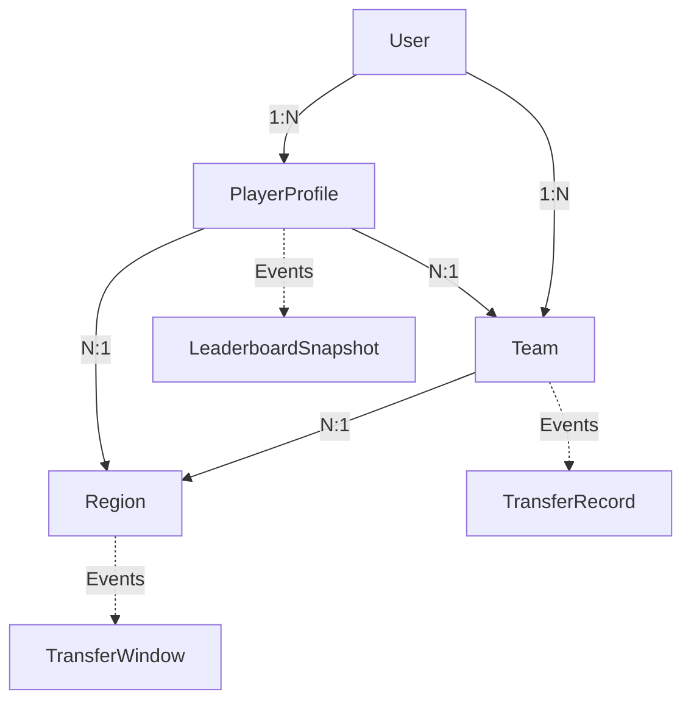

# FlyEsports 领域模型设计

## 目录
- [1. 领域驱动设计概述](#1-领域驱动设计概述)
- [2. 核心聚合根设计](#2-核心聚合根设计)
- [3. 实体设计](#3-实体设计)
- [4. 值对象设计](#4-值对象设计)
- [5. 领域事件设计](#5-领域事件设计)
- [6. 领域服务设计](#6-领域服务设计)
- [7. 仓储接口设计](#7-仓储接口设计)
- [8. 业务规则与约束](#8-业务规则与约束)
- [9. 聚合间关系](#9-聚合间关系)
- [10. 事件溯源设计](#10-事件溯源设计)

## 1. 领域驱动设计概述

### 1.1 设计理念
FlyEsports采用领域驱动设计(DDD)来管理复杂的业务逻辑，确保代码结构与业务概念保持一致。

### 1.2 核心概念
- **聚合根(Aggregate Root)**: 保证数据一致性的边界
- **实体(Entity)**: 具有唯一标识的业务对象
- **值对象(Value Object)**: 描述性的不可变对象
- **领域事件(Domain Event)**: 业务过程中发生的重要事件
- **领域服务(Domain Service)**: 跨聚合的业务逻辑

### 1.3 聚合设计原则
- 聚合内强一致性，聚合间最终一致性
- 通过领域事件实现聚合间通信
- 每个聚合由单一仓储管理
- 聚合大小适中，避免过度复杂

## 2. 核心聚合根设计

### 2.1 User 聚合根

#### 2.1.1 聚合定义
```python
# src/domain/aggregates/user.py
from dataclasses import dataclass, field
from typing import List, Optional
from datetime import datetime
import uuid
from .base import AggregateRoot
from ..value_objects.email import Email
from ..value_objects.user_preferences import UserPreferences
from ..events.user_events import UserCreatedEvent, UserUpdatedEvent

@dataclass
class User(AggregateRoot):
    user_id: str = field(default_factory=lambda: f"usr_{uuid.uuid4().hex[:12]}")
    username: str = ""
    email: Email = None
    password_hash: str = ""
    display_name: str = ""
    avatar_url: Optional[str] = None
    status: str = "active"  # active, suspended, deleted
    preferences: UserPreferences = field(default_factory=UserPreferences)
    created_at: datetime = field(default_factory=datetime.utcnow)
    updated_at: datetime = field(default_factory=datetime.utcnow)
    last_active: Optional[datetime] = None
    
    # 统计信息
    profile_count: int = 0
    total_matches: int = 0
    
    def __post_init__(self):
        super().__post_init__()
        if self.email and not isinstance(self.email, Email):
            self.email = Email(self.email)
    
    @classmethod
    def create(
        cls,
        username: str,
        email: str,
        password_hash: str,
        display_name: str = None
    ) -> 'User':
        """创建新用户"""
        user = cls(
            username=username,
            email=Email(email),
            password_hash=password_hash,
            display_name=display_name or username,
        )
        
        # 发布用户创建事件
        event = UserCreatedEvent(
            user_id=user.user_id,
            username=username,
            email=email,
            timestamp=user.created_at
        )
        user.add_domain_event(event)
        
        return user
    
    def update_profile(
        self,
        display_name: str = None,
        avatar_url: str = None,
        preferences: UserPreferences = None
    ):
        """更新用户资料"""
        old_data = {
            "display_name": self.display_name,
            "avatar_url": self.avatar_url,
            "preferences": self.preferences
        }
        
        if display_name is not None:
            self.display_name = display_name
        if avatar_url is not None:
            self.avatar_url = avatar_url
        if preferences is not None:
            self.preferences = preferences
        
        self.updated_at = datetime.utcnow()
        
        # 发布用户更新事件
        event = UserUpdatedEvent(
            user_id=self.user_id,
            old_data=old_data,
            new_data={
                "display_name": self.display_name,
                "avatar_url": self.avatar_url,
                "preferences": self.preferences
            },
            timestamp=self.updated_at
        )
        self.add_domain_event(event)
    
    def record_activity(self):
        """记录用户活动"""
        self.last_active = datetime.utcnow()
    
    def increment_profile_count(self):
        """增加选手档案数量"""
        self.profile_count += 1
        self.updated_at = datetime.utcnow()
    
    def increment_match_count(self):
        """增加比赛次数"""
        self.total_matches += 1
        self.updated_at = datetime.utcnow()
    
    def suspend(self, reason: str):
        """暂停用户账户"""
        if self.status == "active":
            self.status = "suspended"
            self.updated_at = datetime.utcnow()
            
            from ..events.user_events import UserSuspendedEvent
            event = UserSuspendedEvent(
                user_id=self.user_id,
                reason=reason,
                timestamp=self.updated_at
            )
            self.add_domain_event(event)
    
    def activate(self):
        """激活用户账户"""
        if self.status == "suspended":
            self.status = "active"
            self.updated_at = datetime.utcnow()
```

### 2.2 PlayerProfile 聚合根

#### 2.2.1 聚合定义
```python
# src/domain/aggregates/player_profile.py
from dataclasses import dataclass, field
from typing import Optional, List
from datetime import datetime
import uuid
from .base import AggregateRoot
from ..value_objects.rating import Rating
from ..value_objects.rank_info import RankInfo
from ..value_objects.position import Position
from ..value_objects.contract_status import ContractStatus
from ..entities.match_record import MatchRecord
from ..events.player_events import (
    PlayerRegisteredEvent,
    PlayerRatingUpdatedEvent,
    PlayerSignedEvent,
    PlayerReleasedEvent
)

@dataclass
class PlayerProfile(AggregateRoot):
    profile_id: str = field(default_factory=lambda: f"prf_{uuid.uuid4().hex[:12]}")
    user_id: str = ""
    region_id: str = ""
    player_name: str = ""
    summoner_name: str = ""
    position: Position = None
    description: Optional[str] = None
    
    # 游戏相关信息
    rank_info: RankInfo = None
    rating: Rating = None
    contract_status: ContractStatus = field(default=ContractStatus.FREE)
    
    # 合同信息
    current_team_id: Optional[str] = None
    contract_start: Optional[datetime] = None
    locked_rating: Optional[float] = None
    
    # 统计信息
    total_matches: int = 0
    total_wins: int = 0
    total_losses: int = 0
    
    # 时间戳
    created_at: datetime = field(default_factory=datetime.utcnow)
    updated_at: datetime = field(default_factory=datetime.utcnow)
    last_active: Optional[datetime] = None
    
    # 比赛记录（聚合内实体）
    match_records: List[MatchRecord] = field(default_factory=list)
    
    @classmethod
    def create(
        cls,
        user_id: str,
        region_id: str,
        player_name: str,
        summoner_name: str,
        position: Position,
        rank_info: RankInfo,
        initial_rating: Rating
    ) -> 'PlayerProfile':
        """创建选手档案"""
        profile = cls(
            user_id=user_id,
            region_id=region_id,
            player_name=player_name,
            summoner_name=summoner_name,
            position=position,
            rank_info=rank_info,
            rating=initial_rating
        )
        
        # 发布选手注册事件
        event = PlayerRegisteredEvent(
            profile_id=profile.profile_id,
            user_id=user_id,
            region_id=region_id,
            player_name=player_name,
            position=position.value,
            initial_rating=initial_rating.current_score,
            timestamp=profile.created_at
        )
        profile.add_domain_event(event)
        
        return profile
    
    def update_rating(self, new_rating: Rating, reason: str, match_id: str = None):
        """更新选手评分"""
        if self.contract_status == ContractStatus.LOCKED:
            # 锁定状态下不能更新当前评分，但可以更新潜在评分
            old_score = self.rating.current_score
            self.rating = new_rating.with_locked_score(self.locked_rating)
        else:
            old_score = self.rating.current_score
            self.rating = new_rating
        
        self.updated_at = datetime.utcnow()
        
        # 发布评分更新事件
        event = PlayerRatingUpdatedEvent(
            profile_id=self.profile_id,
            old_rating=old_score,
            new_rating=new_rating.current_score,
            reason=reason,
            match_id=match_id,
            timestamp=self.updated_at
        )
        self.add_domain_event(event)
    
    def sign_to_team(self, team_id: str, locked_rating: float = None) -> float:
        """签约到战队"""
        if self.contract_status != ContractStatus.FREE:
            raise ValueError("Player is not available for signing")
        
        # 锁定当前评分
        self.locked_rating = locked_rating or self.rating.current_score
        self.contract_status = ContractStatus.LOCKED
        self.current_team_id = team_id
        self.contract_start = datetime.utcnow()
        self.updated_at = datetime.utcnow()
        
        # 发布签约事件
        event = PlayerSignedEvent(
            profile_id=self.profile_id,
            team_id=team_id,
            locked_rating=self.locked_rating,
            timestamp=self.updated_at
        )
        self.add_domain_event(event)
        
        return self.locked_rating
    
    def release_from_team(self, reason: str = "contract_ended"):
        """从战队释放"""
        if self.contract_status != ContractStatus.LOCKED:
            raise ValueError("Player is not currently signed")
        
        old_team_id = self.current_team_id
        
        # 解除锁定
        self.contract_status = ContractStatus.FREE
        self.current_team_id = None
        self.contract_start = None
        self.locked_rating = None
        self.updated_at = datetime.utcnow()
        
        # 发布释放事件
        event = PlayerReleasedEvent(
            profile_id=self.profile_id,
            old_team_id=old_team_id,
            reason=reason,
            new_rating=self.rating.current_score,
            timestamp=self.updated_at
        )
        self.add_domain_event(event)
    
    def add_match_record(self, match_record: MatchRecord):
        """添加比赛记录"""
        self.match_records.append(match_record)
        self.total_matches += 1
        
        if match_record.result == "win":
            self.total_wins += 1
        elif match_record.result == "loss":
            self.total_losses += 1
        
        self.last_active = datetime.utcnow()
        self.updated_at = datetime.utcnow()
    
    def update_rank_info(self, rank_info: RankInfo):
        """更新段位信息"""
        self.rank_info = rank_info
        self.updated_at = datetime.utcnow()
    
    @property
    def win_rate(self) -> float:
        """计算胜率"""
        if self.total_matches == 0:
            return 0.0
        return self.total_wins / self.total_matches
    
    @property
    def is_available_for_signing(self) -> bool:
        """是否可以签约"""
        return self.contract_status == ContractStatus.FREE
    
    @property
    def current_market_value(self) -> float:
        """当前市场价值"""
        if self.contract_status == ContractStatus.LOCKED:
            return self.locked_rating
        return self.rating.current_score
```

### 2.3 Team 聚合根

#### 2.3.1 聚合定义
```python
# src/domain/aggregates/team.py
from dataclasses import dataclass, field
from typing import Dict, Optional, List
from datetime import datetime
import uuid
from .base import AggregateRoot
from ..value_objects.position import Position
from ..entities.roster_slot import RosterSlot
from ..events.team_events import (
    TeamCreatedEvent,
    PlayerAddedToTeamEvent,
    PlayerRemovedFromTeamEvent,
    TeamDisbandedEvent
)

@dataclass
class Team(AggregateRoot):
    team_id: str = field(default_factory=lambda: f"team_{uuid.uuid4().hex[:12]}")
    team_name: str = ""
    team_tag: str = ""
    region_id: str = ""
    owner_id: str = ""
    description: Optional[str] = None
    logo_url: Optional[str] = None
    status: str = "active"  # active, disbanded
    
    # 阵容管理
    roster: Dict[Position, Optional[RosterSlot]] = field(default_factory=lambda: {
        Position.TOP: None,
        Position.JUNGLE: None,
        Position.MIDDLE: None,
        Position.BOTTOM: None,
        Position.UTILITY: None
    })
    
    # 统计信息
    total_cost: float = 0.0
    total_matches: int = 0
    total_wins: int = 0
    total_losses: int = 0
    
    # 时间戳
    created_at: datetime = field(default_factory=datetime.utcnow)
    updated_at: datetime = field(default_factory=datetime.utcnow)
    
    @classmethod
    def create(
        cls,
        team_name: str,
        team_tag: str,
        region_id: str,
        owner_id: str,
        description: str = None
    ) -> 'Team':
        """创建战队"""
        team = cls(
            team_name=team_name,
            team_tag=team_tag,
            region_id=region_id,
            owner_id=owner_id,
            description=description
        )
        
        # 发布战队创建事件
        event = TeamCreatedEvent(
            team_id=team.team_id,
            team_name=team_name,
            region_id=region_id,
            owner_id=owner_id,
            timestamp=team.created_at
        )
        team.add_domain_event(event)
        
        return team
    
    def add_player(
        self,
        profile_id: str,
        player_name: str,
        position: Position,
        signing_cost: float
    ):
        """添加选手到战队"""
        if self.roster[position] is not None:
            raise ValueError(f"Position {position.value} is already occupied")
        
        # 创建阵容槽位
        roster_slot = RosterSlot(
            profile_id=profile_id,
            player_name=player_name,
            position=position,
            signing_cost=signing_cost,
            joined_at=datetime.utcnow()
        )
        
        self.roster[position] = roster_slot
        self.total_cost += signing_cost
        self.updated_at = datetime.utcnow()
        
        # 发布选手加入事件
        event = PlayerAddedToTeamEvent(
            team_id=self.team_id,
            profile_id=profile_id,
            position=position.value,
            signing_cost=signing_cost,
            timestamp=self.updated_at
        )
        self.add_domain_event(event)
    
    def remove_player(self, position: Position, reason: str = "released"):
        """移除指定位置的选手"""
        if self.roster[position] is None:
            raise ValueError(f"No player in position {position.value}")
        
        removed_slot = self.roster[position]
        self.roster[position] = None
        self.total_cost -= removed_slot.signing_cost
        self.updated_at = datetime.utcnow()
        
        # 发布选手移除事件
        event = PlayerRemovedFromTeamEvent(
            team_id=self.team_id,
            profile_id=removed_slot.profile_id,
            position=position.value,
            reason=reason,
            cost_reduction=removed_slot.signing_cost,
            timestamp=self.updated_at
        )
        self.add_domain_event(event)
    
    def update_team_info(
        self,
        team_name: str = None,
        team_tag: str = None,
        description: str = None,
        logo_url: str = None
    ):
        """更新战队信息"""
        if team_name is not None:
            self.team_name = team_name
        if team_tag is not None:
            self.team_tag = team_tag
        if description is not None:
            self.description = description
        if logo_url is not None:
            self.logo_url = logo_url
        
        self.updated_at = datetime.utcnow()
    
    def record_match_result(self, result: str):
        """记录比赛结果"""
        self.total_matches += 1
        if result == "win":
            self.total_wins += 1
        elif result == "loss":
            self.total_losses += 1
        
        self.updated_at = datetime.utcnow()
    
    def disband(self, reason: str = "voluntary"):
        """解散战队"""
        if self.status != "active":
            raise ValueError("Team is not active")
        
        self.status = "disbanded"
        self.updated_at = datetime.utcnow()
        
        # 发布战队解散事件
        event = TeamDisbandedEvent(
            team_id=self.team_id,
            reason=reason,
            final_roster=[
                slot.profile_id for slot in self.roster.values() 
                if slot is not None
            ],
            timestamp=self.updated_at
        )
        self.add_domain_event(event)
    
    @property
    def player_count(self) -> int:
        """当前选手数量"""
        return sum(1 for slot in self.roster.values() if slot is not None)
    
    @property
    def is_full_roster(self) -> bool:
        """是否满员"""
        return self.player_count == 5
    
    @property
    def win_rate(self) -> float:
        """胜率"""
        if self.total_matches == 0:
            return 0.0
        return self.total_wins / self.total_matches
    
    @property
    def available_positions(self) -> List[Position]:
        """可用位置列表"""
        return [pos for pos, slot in self.roster.items() if slot is None]
    
    def get_roster_summary(self) -> Dict[str, any]:
        """获取阵容摘要"""
        return {
            "total_players": self.player_count,
            "total_cost": self.total_cost,
            "positions": {
                pos.value: {
                    "profile_id": slot.profile_id,
                    "player_name": slot.player_name,
                    "signing_cost": slot.signing_cost,
                    "joined_at": slot.joined_at
                } if slot else None
                for pos, slot in self.roster.items()
            }
        }
```

### 2.4 Region 聚合根

#### 2.4.1 聚合定义
```python
# src/domain/aggregates/region.py
from dataclasses import dataclass, field
from typing import Dict, Any, List, Optional
from datetime import datetime
import uuid
from .base import AggregateRoot
from ..value_objects.transfer_window import TransferWindow
from ..value_objects.rating_config import RatingConfig
from ..events.region_events import (
    RegionCreatedEvent,
    TransferWindowOpenedEvent,
    TransferWindowClosedEvent,
    RegionConfigUpdatedEvent
)

@dataclass
class Region(AggregateRoot):
    region_id: str = field(default_factory=lambda: f"region_{uuid.uuid4().hex[:8]}")
    region_name: str = ""
    region_code: str = ""
    status: str = "active"  # active, inactive, maintenance
    
    # 赛区配置
    rating_config: RatingConfig = field(default_factory=RatingConfig)
    transfer_windows: List[TransferWindow] = field(default_factory=list)
    
    # 统计信息
    total_players: int = 0
    active_players: int = 0
    total_teams: int = 0
    active_teams: int = 0
    
    # 赛季信息
    current_season: str = ""
    season_start: Optional[datetime] = None
    season_end: Optional[datetime] = None
    
    # 管理员
    admin_users: List[str] = field(default_factory=list)
    
    # 时间戳
    created_at: datetime = field(default_factory=datetime.utcnow)
    updated_at: datetime = field(default_factory=datetime.utcnow)
    
    @classmethod
    def create(
        cls,
        region_name: str,
        region_code: str,
        admin_user_id: str
    ) -> 'Region':
        """创建赛区"""
        region = cls(
            region_name=region_name,
            region_code=region_code.upper(),
            admin_users=[admin_user_id]
        )
        
        # 发布赛区创建事件
        event = RegionCreatedEvent(
            region_id=region.region_id,
            region_name=region_name,
            region_code=region_code,
            admin_user_id=admin_user_id,
            timestamp=region.created_at
        )
        region.add_domain_event(event)
        
        return region
    
    def open_transfer_window(
        self,
        window_name: str,
        start_time: datetime,
        end_time: datetime
    ):
        """开启转会窗口"""
        transfer_window = TransferWindow(
            window_name=window_name,
            start_time=start_time,
            end_time=end_time,
            is_active=True
        )
        
        # 关闭其他活跃的转会窗口
        for window in self.transfer_windows:
            if window.is_active:
                window.close()
        
        self.transfer_windows.append(transfer_window)
        self.updated_at = datetime.utcnow()
        
        # 发布转会窗口开启事件
        event = TransferWindowOpenedEvent(
            region_id=self.region_id,
            window_name=window_name,
            start_time=start_time,
            end_time=end_time,
            timestamp=self.updated_at
        )
        self.add_domain_event(event)
    
    def close_current_transfer_window(self):
        """关闭当前转会窗口"""
        current_window = self.get_current_transfer_window()
        if current_window:
            current_window.close()
            self.updated_at = datetime.utcnow()
            
            # 发布转会窗口关闭事件
            event = TransferWindowClosedEvent(
                region_id=self.region_id,
                window_name=current_window.window_name,
                timestamp=self.updated_at
            )
            self.add_domain_event(event)
    
    def update_rating_config(self, rating_config: RatingConfig):
        """更新评分配置"""
        old_config = self.rating_config
        self.rating_config = rating_config
        self.updated_at = datetime.utcnow()
        
        # 发布配置更新事件
        event = RegionConfigUpdatedEvent(
            region_id=self.region_id,
            old_config=old_config.to_dict(),
            new_config=rating_config.to_dict(),
            timestamp=self.updated_at
        )
        self.add_domain_event(event)
    
    def add_admin(self, user_id: str):
        """添加管理员"""
        if user_id not in self.admin_users:
            self.admin_users.append(user_id)
            self.updated_at = datetime.utcnow()
    
    def remove_admin(self, user_id: str):
        """移除管理员"""
        if user_id in self.admin_users and len(self.admin_users) > 1:
            self.admin_users.remove(user_id)
            self.updated_at = datetime.utcnow()
    
    def update_statistics(
        self,
        total_players: int = None,
        active_players: int = None,
        total_teams: int = None,
        active_teams: int = None
    ):
        """更新统计信息"""
        if total_players is not None:
            self.total_players = total_players
        if active_players is not None:
            self.active_players = active_players
        if total_teams is not None:
            self.total_teams = total_teams
        if active_teams is not None:
            self.active_teams = active_teams
        
        self.updated_at = datetime.utcnow()
    
    def get_current_transfer_window(self) -> Optional[TransferWindow]:
        """获取当前活跃的转会窗口"""
        current_time = datetime.utcnow()
        for window in self.transfer_windows:
            if window.is_active and window.is_open_at(current_time):
                return window
        return None
    
    @property
    def is_transfer_window_open(self) -> bool:
        """转会窗口是否开启"""
        return self.get_current_transfer_window() is not None
    
    def is_user_admin(self, user_id: str) -> bool:
        """检查用户是否为管理员"""
        return user_id in self.admin_users
```

## 3. 实体设计

### 3.1 MatchRecord 实体

```python
# src/domain/entities/match_record.py
from dataclasses import dataclass
from datetime import datetime
from typing import Dict, Any
import uuid

@dataclass
class MatchRecord:
    record_id: str
    match_id: str
    profile_id: str
    result: str  # win, loss, draw
    performance_data: Dict[str, Any]
    rating_before: float
    rating_after: float
    rating_change: float
    played_at: datetime
    
    @classmethod
    def create(
        cls,
        match_id: str,
        profile_id: str,
        result: str,
        performance_data: Dict[str, Any],
        rating_before: float,
        rating_after: float
    ) -> 'MatchRecord':
        return cls(
            record_id=f"rec_{uuid.uuid4().hex[:12]}",
            match_id=match_id,
            profile_id=profile_id,
            result=result,
            performance_data=performance_data,
            rating_before=rating_before,
            rating_after=rating_after,
            rating_change=rating_after - rating_before,
            played_at=datetime.utcnow()
        )
```

### 3.2 RosterSlot 实体

```python
# src/domain/entities/roster_slot.py
from dataclasses import dataclass
from datetime import datetime
from ..value_objects.position import Position

@dataclass
class RosterSlot:
    profile_id: str
    player_name: str
    position: Position
    signing_cost: float
    joined_at: datetime
    contract_type: str = "full_time"  # full_time, substitute, trial
    notes: str = ""
    
    def update_player_name(self, new_name: str):
        """更新选手名称"""
        self.player_name = new_name
    
    def update_contract_type(self, contract_type: str):
        """更新合同类型"""
        self.contract_type = contract_type
```

## 4. 值对象设计

### 4.1 Rating 值对象

```python
# src/domain/value_objects/rating.py
from dataclasses import dataclass
from typing import Dict, Optional

@dataclass(frozen=True)
class Rating:
    current_score: float
    locked_score: Optional[float]
    confidence_level: float
    total_matches: int
    six_dimensions: Dict[str, float]
    
    def __post_init__(self):
        if not (0 <= self.current_score <= 100):
            raise ValueError("Rating score must be between 0 and 100")
        if not (0.5 <= self.confidence_level <= 0.95):
            raise ValueError("Confidence level must be between 0.5 and 0.95")
        if self.total_matches < 0:
            raise ValueError("Total matches cannot be negative")
    
    @classmethod
    def create_initial(cls, initial_score: float) -> 'Rating':
        """创建初始评分"""
        return cls(
            current_score=initial_score,
            locked_score=None,
            confidence_level=0.5,
            total_matches=0,
            six_dimensions={
                "kda": initial_score,
                "damage": initial_score,
                "economy": initial_score,
                "vision": initial_score,
                "objective": initial_score,
                "teamfight": initial_score
            }
        )
    
    def with_new_score(self, new_score: float) -> 'Rating':
        """创建新评分对象（值对象不可变）"""
        return Rating(
            current_score=new_score,
            locked_score=self.locked_score,
            confidence_level=min(self.confidence_level + 0.01, 0.95),
            total_matches=self.total_matches + 1,
            six_dimensions=self.six_dimensions
        )
    
    def with_locked_score(self, locked_value: float) -> 'Rating':
        """创建锁定评分的对象"""
        return Rating(
            current_score=self.current_score,
            locked_score=locked_value,
            confidence_level=self.confidence_level,
            total_matches=self.total_matches,
            six_dimensions=self.six_dimensions
        )
    
    def with_updated_dimensions(self, dimensions: Dict[str, float]) -> 'Rating':
        """创建更新6维度的对象"""
        return Rating(
            current_score=self.current_score,
            locked_score=self.locked_score,
            confidence_level=self.confidence_level,
            total_matches=self.total_matches,
            six_dimensions=dimensions
        )
    
    @property
    def effective_score(self) -> float:
        """有效评分（锁定时返回锁定分，否则返回当前分）"""
        return self.locked_score if self.locked_score is not None else self.current_score
    
    @property
    def is_locked(self) -> bool:
        """是否被锁定"""
        return self.locked_score is not None
```

### 4.2 Position 值对象

```python
# src/domain/value_objects/position.py
from enum import Enum

class Position(Enum):
    TOP = "TOP"
    JUNGLE = "JUNGLE"
    MIDDLE = "MIDDLE"
    BOTTOM = "BOTTOM"
    UTILITY = "UTILITY"
    
    @classmethod
    def from_string(cls, position_str: str) -> 'Position':
        """从字符串创建Position"""
        try:
            return cls(position_str.upper())
        except ValueError:
            raise ValueError(f"Invalid position: {position_str}")
    
    @property
    def display_name(self) -> str:
        """显示名称"""
        name_mapping = {
            "TOP": "上单",
            "JUNGLE": "打野",
            "MIDDLE": "中单", 
            "BOTTOM": "下路",
            "UTILITY": "辅助"
        }
        return name_mapping.get(self.value, self.value)
    
    @property
    def index(self) -> int:
        """位置索引"""
        return list(Position).index(self)
```

### 4.3 RankInfo 值对象

```python
# src/domain/value_objects/rank_info.py
from dataclasses import dataclass
from enum import Enum
from typing import Optional

class Tier(Enum):
    IRON = "IRON"
    BRONZE = "BRONZE"
    SILVER = "SILVER"
    GOLD = "GOLD"
    PLATINUM = "PLATINUM"
    DIAMOND = "DIAMOND"
    MASTER = "MASTER"
    GRANDMASTER = "GRANDMASTER"
    CHALLENGER = "CHALLENGER"

class Rank(Enum):
    IV = "IV"
    III = "III"
    II = "II"
    I = "I"

@dataclass(frozen=True)
class RankInfo:
    tier: Tier
    rank: Optional[Rank]  # Master+没有rank
    league_points: int
    wins: int
    losses: int
    queue_type: str = "RANKED_SOLO_5x5"
    
    def __post_init__(self):
        if self.league_points < 0:
            raise ValueError("League points cannot be negative")
        if self.wins < 0 or self.losses < 0:
            raise ValueError("Wins and losses cannot be negative")
        
        # Master+段位不应该有rank
        if self.tier in [Tier.MASTER, Tier.GRANDMASTER, Tier.CHALLENGER]:
            if self.rank is not None:
                object.__setattr__(self, 'rank', None)
    
    @classmethod
    def from_riot_data(cls, riot_data: dict) -> 'RankInfo':
        """从Riot API数据创建RankInfo"""
        tier = Tier(riot_data['tier'])
        rank = None
        if riot_data.get('rank') and tier not in [Tier.MASTER, Tier.GRANDMASTER, Tier.CHALLENGER]:
            rank = Rank(riot_data['rank'])
        
        return cls(
            tier=tier,
            rank=rank,
            league_points=riot_data['leaguePoints'],
            wins=riot_data['wins'],
            losses=riot_data['losses'],
            queue_type=riot_data.get('queueType', 'RANKED_SOLO_5x5')
        )
    
    @property
    def total_games(self) -> int:
        """总游戏数"""
        return self.wins + self.losses
    
    @property
    def win_rate(self) -> float:
        """胜率"""
        if self.total_games == 0:
            return 0.0
        return self.wins / self.total_games
    
    @property
    def display_rank(self) -> str:
        """显示的段位"""
        if self.rank:
            return f"{self.tier.value} {self.rank.value}"
        return self.tier.value
    
    @property
    def numeric_value(self) -> int:
        """用于排序的数值"""
        tier_values = {
            Tier.IRON: 100,
            Tier.BRONZE: 200,
            Tier.SILVER: 300,
            Tier.GOLD: 400,
            Tier.PLATINUM: 500,
            Tier.DIAMOND: 600,
            Tier.MASTER: 700,
            Tier.GRANDMASTER: 800,
            Tier.CHALLENGER: 900
        }
        
        base_value = tier_values[self.tier]
        
        if self.rank:
            rank_values = {Rank.IV: 0, Rank.III: 25, Rank.II: 50, Rank.I: 75}
            base_value += rank_values[self.rank]
        
        # LP调整（最多24分）
        lp_adjustment = min(self.league_points / 100 * 24, 24)
        
        return base_value + int(lp_adjustment)
```

### 4.4 ContractStatus 值对象

```python
# src/domain/value_objects/contract_status.py
from enum import Enum

class ContractStatus(Enum):
    FREE = "FREE"          # 自由选手
    LOCKED = "LOCKED"      # 已签约
    SUSPENDED = "SUSPENDED" # 暂停状态
    RETIRED = "RETIRED"    # 退役
    
    @property
    def display_name(self) -> str:
        """显示名称"""
        names = {
            "FREE": "自由选手",
            "LOCKED": "已签约",
            "SUSPENDED": "暂停",
            "RETIRED": "退役"
        }
        return names.get(self.value, self.value)
    
    @property
    def is_available(self) -> bool:
        """是否可以签约"""
        return self == ContractStatus.FREE
    
    @property
    def is_active(self) -> bool:
        """是否活跃状态"""
        return self in [ContractStatus.FREE, ContractStatus.LOCKED]
```

## 5. 领域事件设计

### 5.1 基础事件类

```python
# src/domain/events/base.py
from abc import ABC
from dataclasses import dataclass
from datetime import datetime
from typing import Dict, Any
import uuid

@dataclass
class DomainEvent(ABC):
    event_id: str = None
    timestamp: datetime = None
    aggregate_id: str = ""
    aggregate_type: str = ""
    event_version: int = 1
    
    def __post_init__(self):
        if self.event_id is None:
            self.event_id = str(uuid.uuid4())
        if self.timestamp is None:
            self.timestamp = datetime.utcnow()
    
    def to_dict(self) -> Dict[str, Any]:
        return {
            "event_id": self.event_id,
            "event_type": self.__class__.__name__,
            "aggregate_id": self.aggregate_id,
            "aggregate_type": self.aggregate_type,
            "timestamp": self.timestamp.isoformat(),
            "event_version": self.event_version,
            "data": {k: v for k, v in self.__dict__.items() 
                    if k not in ['event_id', 'timestamp', 'aggregate_id', 'aggregate_type', 'event_version']}
        }
```

### 5.2 用户相关事件

```python
# src/domain/events/user_events.py
from dataclasses import dataclass
from .base import DomainEvent

@dataclass
class UserCreatedEvent(DomainEvent):
    user_id: str
    username: str
    email: str
    
    def __post_init__(self):
        super().__post_init__()
        self.aggregate_id = self.user_id
        self.aggregate_type = "User"

@dataclass
class UserUpdatedEvent(DomainEvent):
    user_id: str
    old_data: dict
    new_data: dict
    
    def __post_init__(self):
        super().__post_init__()
        self.aggregate_id = self.user_id
        self.aggregate_type = "User"

@dataclass
class UserSuspendedEvent(DomainEvent):
    user_id: str
    reason: str
    
    def __post_init__(self):
        super().__post_init__()
        self.aggregate_id = self.user_id
        self.aggregate_type = "User"
```

### 5.3 选手相关事件

```python
# src/domain/events/player_events.py
from dataclasses import dataclass
from typing import Optional
from .base import DomainEvent

@dataclass
class PlayerRegisteredEvent(DomainEvent):
    profile_id: str
    user_id: str
    region_id: str
    player_name: str
    position: str
    initial_rating: float
    
    def __post_init__(self):
        super().__post_init__()
        self.aggregate_id = self.profile_id
        self.aggregate_type = "PlayerProfile"

@dataclass
class PlayerRatingUpdatedEvent(DomainEvent):
    profile_id: str
    old_rating: float
    new_rating: float
    reason: str
    match_id: Optional[str] = None
    
    def __post_init__(self):
        super().__post_init__()
        self.aggregate_id = self.profile_id
        self.aggregate_type = "PlayerProfile"

@dataclass
class PlayerSignedEvent(DomainEvent):
    profile_id: str
    team_id: str
    locked_rating: float
    
    def __post_init__(self):
        super().__post_init__()
        self.aggregate_id = self.profile_id
        self.aggregate_type = "PlayerProfile"

@dataclass
class PlayerReleasedEvent(DomainEvent):
    profile_id: str
    old_team_id: str
    reason: str
    new_rating: float
    
    def __post_init__(self):
        super().__post_init__()
        self.aggregate_id = self.profile_id
        self.aggregate_type = "PlayerProfile"
```

## 6. 领域服务设计

### 6.1 评分计算服务

```python
# src/domain/services/rating_calculation_service.py
from typing import List, Dict, Any
from ..value_objects.rating import Rating
from ..value_objects.rank_info import RankInfo
from ..value_objects.position import Position

class RatingCalculationService:
    def __init__(self):
        self.base_rating = 50.0
        self.k_factor_base = 32
        self.confidence_growth = 0.01
    
    def calculate_initial_rating(
        self, 
        rank_info: RankInfo, 
        position: Position
    ) -> Rating:
        """计算初始评分"""
        # 基于段位的基础分
        base_score = self._get_tier_base_score(rank_info.tier)
        
        # 段位内调整
        rank_adjustment = self._get_rank_adjustment(rank_info.rank)
        
        # LP调整
        lp_adjustment = self._get_lp_adjustment(rank_info.league_points, rank_info.tier)
        
        # 胜率调整
        wr_adjustment = self._get_winrate_adjustment(rank_info.win_rate)
        
        initial_score = base_score + rank_adjustment + lp_adjustment + wr_adjustment
        initial_score = max(0, min(100, initial_score))
        
        return Rating.create_initial(initial_score)
    
    def calculate_elo_change(
        self,
        player_rating: Rating,
        opponent_ratings: List[Rating],
        match_result: float,  # 1.0 = win, 0.0 = loss
        performance_data: Dict[str, Any]
    ) -> Rating:
        """计算ELO变化"""
        # 期望得分
        expected_score = self._calculate_expected_score(player_rating, opponent_ratings)
        
        # 动态K因子
        k_factor = self._calculate_k_factor(player_rating)
        
        # 基础ELO变化
        rating_change = k_factor * (match_result - expected_score)
        
        # 表现调整
        performance_modifier = self._calculate_performance_modifier(
            performance_data, player_rating.six_dimensions
        )
        
        # 最终评分
        new_score = player_rating.current_score + rating_change + performance_modifier
        new_score = max(0, min(100, new_score))
        
        return player_rating.with_new_score(new_score)
    
    def _get_tier_base_score(self, tier) -> float:
        """获取段位基础分"""
        tier_scores = {
            "IRON": 15, "BRONZE": 25, "SILVER": 35, "GOLD": 45,
            "PLATINUM": 55, "DIAMOND": 70, "MASTER": 80,
            "GRANDMASTER": 90, "CHALLENGER": 95
        }
        return tier_scores.get(tier.value, 35)
    
    def _calculate_expected_score(self, player: Rating, opponents: List[Rating]) -> float:
        """计算期望得分"""
        if not opponents:
            return 0.5
        
        avg_opponent_rating = sum(r.current_score for r in opponents) / len(opponents)
        rating_diff = player.current_score - avg_opponent_rating
        
        return 1 / (1 + 10 ** (-rating_diff / 20))
    
    def _calculate_k_factor(self, rating: Rating) -> float:
        """计算动态K因子"""
        base_k = self.k_factor_base
        
        # 经验调整
        if rating.total_matches < 10:
            experience_mult = 1.5
        elif rating.total_matches < 50:
            experience_mult = 1.2
        else:
            experience_mult = 1.0
        
        # 置信度调整
        confidence_mult = 1.0 + (1.0 - rating.confidence_level)
        
        return base_k * experience_mult * confidence_mult
```

### 6.2 转会费计算服务

```python
# src/domain/services/transfer_fee_service.py
from typing import Optional
from ..aggregates.player_profile import PlayerProfile
from ..aggregates.team import Team

class TransferFeeService:
    def calculate_transfer_fee(
        self,
        player_profile: PlayerProfile,
        from_team: Team,
        to_team: Team,
        transfer_type: str = "permanent"
    ) -> float:
        """计算转会费"""
        base_value = player_profile.locked_rating or player_profile.rating.current_score
        
        # 基础转会费倍数
        base_multiplier = 1.0
        
        # 合同剩余时间调整
        if player_profile.contract_start:
            remaining_ratio = self._calculate_remaining_contract_ratio(player_profile)
            base_multiplier *= remaining_ratio
        
        # 队伍实力差距调整
        team_gap_multiplier = self._calculate_team_gap_multiplier(from_team, to_team)
        
        # 市场供需调整
        market_multiplier = self._calculate_market_multiplier(
            player_profile.position, player_profile.region_id
        )
        
        # 紧急程度调整
        urgency_multiplier = self._calculate_urgency_multiplier(transfer_type)
        
        total_multiplier = base_multiplier * team_gap_multiplier * market_multiplier * urgency_multiplier
        
        return base_value * total_multiplier
    
    def _calculate_remaining_contract_ratio(self, player: PlayerProfile) -> float:
        """计算合同剩余比例调整"""
        # 假设合同期为一年
        from datetime import datetime, timedelta
        
        if not player.contract_start:
            return 1.0
        
        contract_duration = timedelta(days=365)
        elapsed = datetime.utcnow() - player.contract_start
        remaining_ratio = max(0, 1 - elapsed.total_seconds() / contract_duration.total_seconds())
        
        # 剩余时间越多，转会费越高
        return 0.5 + remaining_ratio * 0.5
    
    def _calculate_team_gap_multiplier(self, from_team: Team, to_team: Team) -> float:
        """计算队伍实力差距调整"""
        # 简化实现，基于队伍平均评分
        from_avg = self._calculate_team_average_rating(from_team)
        to_avg = self._calculate_team_average_rating(to_team)
        
        if to_avg > from_avg:
            # 转到更强队伍，费用增加
            return 1.0 + (to_avg - from_avg) / 100
        else:
            # 转到较弱队伍，费用减少
            return 1.0 - (from_avg - to_avg) / 200
    
    def _calculate_team_average_rating(self, team: Team) -> float:
        """计算队伍平均评分（简化）"""
        # 这里需要访问选手评分数据，实际实现中可能需要额外的服务
        return 50.0  # 暂时返回默认值
```

## 7. 仓储接口设计

### 7.1 基础仓储接口

```python
# src/domain/repositories/base.py
from abc import ABC, abstractmethod
from typing import List, Optional, Dict, Any
from ..aggregates.base import AggregateRoot

class Repository(ABC):
    @abstractmethod
    async def get_by_id(self, id: str) -> Optional[AggregateRoot]:
        pass
    
    @abstractmethod
    async def save(self, aggregate: AggregateRoot) -> None:
        pass
    
    @abstractmethod
    async def delete(self, id: str) -> None:
        pass
    
    @abstractmethod
    async def exists(self, id: str) -> bool:
        pass
```

### 7.2 用户仓储接口

```python
# src/domain/repositories/user_repository.py
from abc import abstractmethod
from typing import Optional, List
from .base import Repository
from ..aggregates.user import User

class UserRepository(Repository):
    @abstractmethod
    async def get_by_email(self, email: str) -> Optional[User]:
        pass
    
    @abstractmethod
    async def get_by_username(self, username: str) -> Optional[User]:
        pass
    
    @abstractmethod
    async def find_by_status(self, status: str) -> List[User]:
        pass
    
    @abstractmethod
    async def email_exists(self, email: str) -> bool:
        pass
    
    @abstractmethod
    async def username_exists(self, username: str) -> bool:
        pass
```

### 7.3 选手档案仓储接口

```python
# src/domain/repositories/player_repository.py
from abc import abstractmethod
from typing import Optional, List, Dict, Any
from .base import Repository
from ..aggregates.player_profile import PlayerProfile
from ..value_objects.position import Position
from ..value_objects.contract_status import ContractStatus

class PlayerRepository(Repository):
    @abstractmethod
    async def get_by_user_and_region(self, user_id: str, region_id: str) -> Optional[PlayerProfile]:
        pass
    
    @abstractmethod
    async def find_by_region(self, region_id: str) -> List[PlayerProfile]:
        pass
    
    @abstractmethod
    async def find_by_position(self, region_id: str, position: Position) -> List[PlayerProfile]:
        pass
    
    @abstractmethod
    async def find_by_status(self, region_id: str, status: ContractStatus) -> List[PlayerProfile]:
        pass
    
    @abstractmethod
    async def find_by_team(self, team_id: str) -> List[PlayerProfile]:
        pass
    
    @abstractmethod
    async def get_leaderboard(
        self,
        region_id: str,
        position: Optional[Position] = None,
        limit: int = 50,
        offset: int = 0
    ) -> List[PlayerProfile]:
        pass
    
    @abstractmethod
    async def search_players(
        self,
        region_id: str,
        filters: Dict[str, Any],
        sort_by: str = "rating",
        limit: int = 50,
        offset: int = 0
    ) -> List[PlayerProfile]:
        pass
    
    @abstractmethod
    async def count_by_region(self, region_id: str) -> int:
        pass
```

## 8. 业务规则与约束

### 8.1 用户相关规则

```python
# src/domain/rules/user_rules.py
from ..aggregates.user import User
from ..exceptions import BusinessRuleViolationError

class UserBusinessRules:
    @staticmethod
    def validate_user_creation(username: str, email: str):
        """验证用户创建规则"""
        if len(username) < 3 or len(username) > 20:
            raise BusinessRuleViolationError("Username must be between 3-20 characters")
        
        if not email or "@" not in email:
            raise BusinessRuleViolationError("Invalid email format")
    
    @staticmethod
    def can_create_player_profile(user: User, region_id: str) -> bool:
        """检查是否可以创建选手档案"""
        # 检查用户状态
        if user.status != "active":
            return False
        
        # 检查是否已达到最大档案数量限制
        if user.profile_count >= 5:  # 最多5个赛区
            return False
        
        return True
```

### 8.2 选手相关规则

```python
# src/domain/rules/player_rules.py
from ..aggregates.player_profile import PlayerProfile
from ..aggregates.team import Team
from ..value_objects.position import Position
from ..exceptions import BusinessRuleViolationError

class PlayerBusinessRules:
    @staticmethod
    def validate_player_registration(
        user_id: str, 
        region_id: str, 
        player_name: str,
        summoner_name: str
    ):
        """验证选手注册规则"""
        if len(player_name) < 2 or len(player_name) > 16:
            raise BusinessRuleViolationError("Player name must be between 2-16 characters")
        
        if len(summoner_name) < 3 or len(summoner_name) > 16:
            raise BusinessRuleViolationError("Summoner name must be between 3-16 characters")
    
    @staticmethod
    def can_sign_to_team(player: PlayerProfile, team: Team, position: Position) -> bool:
        """检查是否可以签约"""
        # 检查选手状态
        if not player.is_available_for_signing:
            return False
        
        # 检查队伍状态
        if team.status != "active":
            return False
        
        # 检查位置是否可用
        if team.roster[position] is not None:
            return False
        
        # 检查是否同一赛区
        if player.region_id != team.region_id:
            return False
        
        return True
    
    @staticmethod
    def validate_rating_update(
        current_rating: float, 
        new_rating: float, 
        is_locked: bool
    ):
        """验证评分更新规则"""
        if is_locked:
            raise BusinessRuleViolationError("Cannot update rating for locked player")
        
        if abs(new_rating - current_rating) > 20:
            raise BusinessRuleViolationError("Rating change too large (max 20 points)")
```

### 8.3 战队相关规则

```python
# src/domain/rules/team_rules.py
from ..aggregates.team import Team
from ..value_objects.position import Position
from ..exceptions import BusinessRuleViolationError

class TeamBusinessRules:
    @staticmethod
    def validate_team_creation(team_name: str, team_tag: str):
        """验证战队创建规则"""
        if len(team_name) < 2 or len(team_name) > 32:
            raise BusinessRuleViolationError("Team name must be between 2-32 characters")
        
        if len(team_tag) < 2 or len(team_tag) > 5:
            raise BusinessRuleViolationError("Team tag must be between 2-5 characters")
    
    @staticmethod
    def can_add_player(team: Team, position: Position, signing_cost: float) -> bool:
        """检查是否可以添加选手"""
        # 检查位置是否已被占用
        if team.roster[position] is not None:
            return False
        
        # 检查预算限制（假设500分预算上限）
        if team.total_cost + signing_cost > 500:
            return False
        
        return True
    
    @staticmethod
    def validate_roster_completeness(team: Team) -> bool:
        """验证阵容完整性"""
        return all(slot is not None for slot in team.roster.values())
```

## 9. 聚合间关系

### 9.1 关系图



### 9.2 聚合交互规则

1. **User → PlayerProfile**
   - 一个用户可以在多个赛区创建选手档案
   - 选手档案创建时需要验证用户状态和限制

2. **PlayerProfile → Team**
   - 选手只能签约同赛区的战队
   - 签约时评分被锁定，解约时解锁

3. **Team → Region**
   - 战队归属于特定赛区
   - 转会操作受赛区转会窗口限制

4. **跨聚合通信**
   - 通过领域事件实现最终一致性
   - 避免聚合间的直接引用

## 10. 事件溯源设计

### 10.1 事件存储

```python
# src/domain/event_sourcing/event_store.py
from typing import List, Optional
from datetime import datetime
from .event_stream import EventStream
from ..events.base import DomainEvent

class EventStore:
    async def append_events(
        self, 
        stream_id: str, 
        events: List[DomainEvent], 
        expected_version: int = -1
    ):
        """追加事件到流"""
        pass
    
    async def read_events(
        self, 
        stream_id: str, 
        from_version: int = 0
    ) -> List[DomainEvent]:
        """读取事件流"""
        pass
    
    async def get_stream_version(self, stream_id: str) -> int:
        """获取流版本"""
        pass
```

### 10.2 事件重播

```python
# src/domain/event_sourcing/aggregate_rebuilder.py
from typing import TypeVar, Type
from ..aggregates.base import AggregateRoot
from .event_store import EventStore

T = TypeVar('T', bound=AggregateRoot)

class AggregateRebuilder:
    def __init__(self, event_store: EventStore):
        self.event_store = event_store
    
    async def rebuild_aggregate(
        self, 
        aggregate_type: Type[T], 
        aggregate_id: str
    ) -> T:
        """从事件重建聚合"""
        events = await self.event_store.read_events(aggregate_id)
        
        if not events:
            return None
        
        # 创建空聚合
        aggregate = aggregate_type()
        
        # 重播事件
        for event in events:
            aggregate.apply_event(event)
        
        return aggregate
```

## 总结

FlyEsports的领域模型设计遵循DDD最佳实践，通过明确的聚合边界、丰富的业务对象和完善的事件机制，确保了系统的业务语义清晰和技术实现的可维护性。每个聚合都有明确的职责，通过领域事件实现松耦合的交互，为复杂的电竞选手管理业务提供了坚实的领域基础。