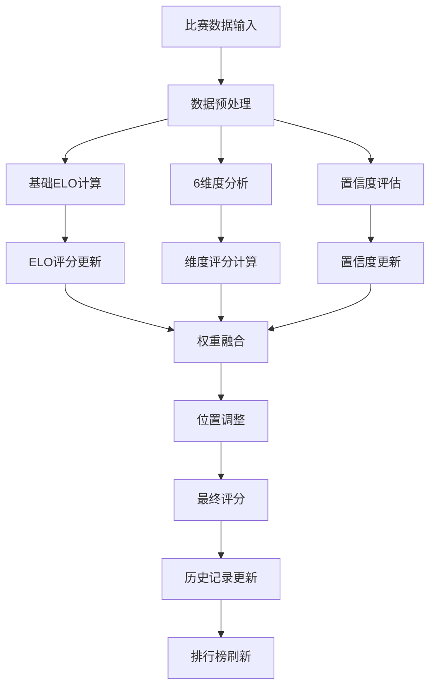

# FlyEsports 评分算法详细规范

## 目录
- [1. 算法设计概述](#1-算法设计概述)
- [2. 动态ELO评分系统](#2-动态elo评分系统)
- [3. 6维度评估体系](#3-6维度评估体系)
- [4. 置信度管理机制](#4-置信度管理机制)
- [5. 位置权重系统](#5-位置权重系统)
- [6. 初始评分计算](#6-初始评分计算)
- [7. 实时评分更新](#7-实时评分更新)
- [8. 加权评分融合](#8-加权评分融合)
- [9. 算法参数调优](#9-算法参数调优)
- [10. 性能优化方案](#10-性能优化方案)

## 1. 算法设计概述

### 1.1 设计理念

FlyEsports的评分算法结合了传统ELO系统的稳定性和现代电竞数据分析的精确性，旨在：

- **客观性**: 基于实际比赛数据，减少主观因素影响
- **准确性**: 多维度综合评估，全面反映选手实力
- **动态性**: 实时更新，快速反映选手状态变化
- **公平性**: 考虑位置特性，确保不同位置选手评分公平
- **可解释性**: 透明的计算过程，便于理解和调整

### 1.2 核心组成

```python
# 评分系统的核心组件
class RatingSystem:
    """
    FlyEsports评分系统核心架构
    
    Components:
    1. BaseELO: 基础ELO评分 (50分基准, 0-100分区间)
    2. SixDimensions: 6维度表现分析
    3. ConfidenceLevel: 置信度管理 (0.5-0.95)
    4. PositionWeights: 位置权重差异化
    5. KFactor: 动态K因子调整
    """
    
    def __init__(self):
        self.base_rating = 50.0         # 基础评分
        self.min_rating = 0.0           # 最低评分
        self.max_rating = 100.0         # 最高评分
        self.initial_confidence = 0.5   # 初始置信度
        self.max_confidence = 0.95      # 最大置信度
        
        # 6维度权重配置
        self.dimensions = {
            'kda': 0.20,        # KDA表现
            'damage': 0.20,     # 伤害输出
            'economy': 0.15,    # 经济发育
            'vision': 0.15,     # 视野控制
            'objective': 0.15,  # 目标控制
            'teamfight': 0.15   # 团战贡献
        }
```

### 1.3 算法流程



## 2. 动态ELO评分系统

### 2.1 基础ELO公式

```python
# src/domain/services/elo_calculator.py
import math
from typing import List, Tuple
from datetime import datetime

class ELOCalculator:
    """ELO评分计算器"""
    
    def __init__(self):
        self.base_k_factor = 32
        self.rating_scale = 20  # ELO标准差参数
    
    def calculate_elo_change(
        self,
        player_rating: float,
        opponent_ratings: List[float],
        result: float,  # 1.0 = 胜利, 0.0 = 失败, 0.5 = 平局
        k_factor: float = None
    ) -> float:
        """
        计算ELO评分变化
        
        Args:
            player_rating: 选手当前评分
            opponent_ratings: 对手评分列表
            result: 比赛结果 (0-1)
            k_factor: K因子（可选）
            
        Returns:
            评分变化值
        """
        if not opponent_ratings:
            return 0.0
        
        # 计算期望得分
        expected_score = self._calculate_expected_score(player_rating, opponent_ratings)
        
        # 使用动态K因子或默认值
        if k_factor is None:
            k_factor = self.base_k_factor
        
        # ELO变化 = K * (实际结果 - 期望结果)
        rating_change = k_factor * (result - expected_score)
        
        return rating_change
    
    def _calculate_expected_score(
        self, 
        player_rating: float, 
        opponent_ratings: List[float]
    ) -> float:
        """
        计算期望得分
        
        使用标准ELO期望公式：
        E = 1 / (1 + 10^((R_opponent - R_player) / scale))
        
        对于多个对手，使用平均评分
        """
        if not opponent_ratings:
            return 0.5
        
        # 计算对手平均评分
        avg_opponent_rating = sum(opponent_ratings) / len(opponent_ratings)
        
        # 评分差异
        rating_diff = avg_opponent_rating - player_rating
        
        # 期望得分公式
        expected = 1.0 / (1.0 + math.pow(10, rating_diff / self.rating_scale))
        
        return expected
    
    def calculate_team_expected_score(
        self,
        team_ratings: List[float],
        opponent_team_ratings: List[float]
    ) -> float:
        """
        计算团队期望得分
        
        对于5v5团队比赛，需要考虑整个团队的评分分布
        """
        if not team_ratings or not opponent_team_ratings:
            return 0.5
        
        # 团队平均评分
        team_avg = sum(team_ratings) / len(team_ratings)
        opponent_avg = sum(opponent_team_ratings) / len(opponent_team_ratings)
        
        # 团队评分方差（体现团队平衡性）
        team_variance = self._calculate_variance(team_ratings)
        opponent_variance = self._calculate_variance(opponent_team_ratings)
        
        # 基础期望得分
        base_expected = 1.0 / (1.0 + math.pow(10, (opponent_avg - team_avg) / self.rating_scale))
        
        # 根据团队平衡性调整
        # 更平衡的团队（方差小）获得小幅加成
        balance_factor = 1.0 + (opponent_variance - team_variance) / 1000.0
        balance_factor = max(0.95, min(1.05, balance_factor))  # 限制在±5%
        
        expected = base_expected * balance_factor
        return max(0.01, min(0.99, expected))  # 确保在有效范围内
    
    def _calculate_variance(self, ratings: List[float]) -> float:
        """计算评分方差"""
        if len(ratings) <= 1:
            return 0.0
        
        mean = sum(ratings) / len(ratings)
        variance = sum((r - mean) ** 2 for r in ratings) / len(ratings)
        return variance

class DynamicKFactorCalculator:
    """动态K因子计算器"""
    
    def __init__(self):
        self.base_k = 32
        self.min_k = 16
        self.max_k = 64
    
    def calculate_k_factor(
        self,
        current_rating: float,
        confidence_level: float,
        total_matches: int,
        recent_performance_variance: float = 0.0
    ) -> float:
        """
        计算动态K因子
        
        Args:
            current_rating: 当前评分
            confidence_level: 置信度水平
            total_matches: 总比赛场数
            recent_performance_variance: 近期表现方差
            
        Returns:
            调整后的K因子
        """
        k_factor = self.base_k
        
        # 1. 基于比赛经验调整
        experience_multiplier = self._get_experience_multiplier(total_matches)
        k_factor *= experience_multiplier
        
        # 2. 基于置信度调整
        confidence_multiplier = self._get_confidence_multiplier(confidence_level)
        k_factor *= confidence_multiplier
        
        # 3. 基于评分区间调整
        rating_multiplier = self._get_rating_multiplier(current_rating)
        k_factor *= rating_multiplier
        
        # 4. 基于表现稳定性调整
        if recent_performance_variance > 0:
            stability_multiplier = self._get_stability_multiplier(recent_performance_variance)
            k_factor *= stability_multiplier
        
        # 确保K因子在合理范围内
        k_factor = max(self.min_k, min(self.max_k, k_factor))
        
        return k_factor
    
    def _get_experience_multiplier(self, total_matches: int) -> float:
        """基于经验的K因子调整"""
        if total_matches < 10:
            return 1.8  # 新手期，变化更大
        elif total_matches < 50:
            return 1.4  # 成长期
        elif total_matches < 200:
            return 1.1  # 稳定期
        else:
            return 1.0  # 成熟期，变化较小
    
    def _get_confidence_multiplier(self, confidence_level: float) -> float:
        """基于置信度的K因子调整"""
        # 置信度越低，K因子越大（不确定性更高）
        return 1.0 + (1.0 - confidence_level) * 0.5
    
    def _get_rating_multiplier(self, rating: float) -> float:
        """基于评分区间的K因子调整"""
        if rating <= 20:
            return 1.3  # 低分段，提升更容易
        elif rating >= 80:
            return 0.8  # 高分段，变化更谨慎
        else:
            return 1.0  # 中等分段，正常变化
    
    def _get_stability_multiplier(self, variance: float) -> float:
        """基于表现稳定性的K因子调整"""
        # 表现波动大的选手，K因子适当增加
        if variance > 100:  # 高方差
            return 1.2
        elif variance > 50:  # 中等方差
            return 1.1
        else:  # 低方差（稳定）
            return 1.0
```

### 2.2 评分更新实现

```python
# src/domain/services/rating_update_service.py
from typing import Dict, List, Any, Optional
from datetime import datetime, timedelta
from ..value_objects.rating import Rating
from ..value_objects.match_performance import MatchPerformance

class RatingUpdateService:
    """评分更新服务"""
    
    def __init__(self):
        self.elo_calculator = ELOCalculator()
        self.k_factor_calculator = DynamicKFactorCalculator()
        self.six_dimension_analyzer = SixDimensionAnalyzer()
    
    async def update_player_rating(
        self,
        player_profile_id: str,
        match_performance: MatchPerformance,
        opponent_performances: List[MatchPerformance],
        match_result: float,
        current_rating: Rating
    ) -> Rating:
        """
        更新选手评分
        
        Args:
            player_profile_id: 选手档案ID
            match_performance: 选手比赛表现
            opponent_performances: 对手表现列表
            match_result: 比赛结果 (1.0=胜, 0.0=败)
            current_rating: 当前评分
            
        Returns:
            更新后的评分对象
        """
        
        # 1. 计算基础ELO变化
        elo_change = await self._calculate_elo_change(
            current_rating, opponent_performances, match_result
        )
        
        # 2. 分析6维度表现
        dimension_scores = await self._analyze_six_dimensions(
            match_performance, player_profile_id
        )
        
        # 3. 计算表现调整
        performance_adjustment = await self._calculate_performance_adjustment(
            dimension_scores, current_rating.six_dimensions, match_performance.position
        )
        
        # 4. 计算最终评分变化
        total_change = elo_change + performance_adjustment
        
        # 5. 应用评分变化
        new_score = current_rating.current_score + total_change
        new_score = max(0, min(100, new_score))  # 确保在0-100范围内
        
        # 6. 更新置信度
        new_confidence = await self._update_confidence_level(
            current_rating, abs(total_change), match_performance.match_duration
        )
        
        # 7. 创建新的评分对象
        new_rating = Rating(
            current_score=new_score,
            locked_score=current_rating.locked_score,
            confidence_level=new_confidence,
            total_matches=current_rating.total_matches + 1,
            six_dimensions=dimension_scores
        )
        
        return new_rating
    
    async def _calculate_elo_change(
        self,
        current_rating: Rating,
        opponent_performances: List[MatchPerformance],
        match_result: float
    ) -> float:
        """计算ELO评分变化"""
        
        # 获取对手评分
        opponent_ratings = [perf.player_rating for perf in opponent_performances]
        
        # 计算动态K因子
        k_factor = self.k_factor_calculator.calculate_k_factor(
            current_rating.current_score,
            current_rating.confidence_level,
            current_rating.total_matches
        )
        
        # 计算ELO变化
        elo_change = self.elo_calculator.calculate_elo_change(
            current_rating.current_score,
            opponent_ratings,
            match_result,
            k_factor
        )
        
        return elo_change
    
    async def _analyze_six_dimensions(
        self,
        performance: MatchPerformance,
        player_profile_id: str
    ) -> Dict[str, float]:
        """分析6维度表现"""
        
        return await self.six_dimension_analyzer.analyze_performance(
            performance, player_profile_id
        )
    
    async def _calculate_performance_adjustment(
        self,
        current_dimensions: Dict[str, float],
        historical_dimensions: Dict[str, float],
        position: str
    ) -> float:
        """
        计算基于表现的评分调整
        
        根据6维度表现相对于历史平均的变化来调整评分
        """
        
        # 获取位置权重
        position_weights = self._get_position_weights(position)
        
        total_adjustment = 0.0
        
        for dimension, current_score in current_dimensions.items():
            historical_score = historical_dimensions.get(dimension, 50.0)
            weight = position_weights.get(dimension, 0.0)
            
            # 计算维度差异
            dimension_diff = current_score - historical_score
            
            # 应用权重和缩放因子
            adjustment = dimension_diff * weight * 0.1  # 缩放因子0.1
            total_adjustment += adjustment
        
        # 限制调整幅度在±5分内
        return max(-5.0, min(5.0, total_adjustment))
    
    async def _update_confidence_level(
        self,
        current_rating: Rating,
        rating_change_magnitude: float,
        match_duration: int
    ) -> float:
        """更新置信度水平"""
        
        current_confidence = current_rating.confidence_level
        
        # 基础置信度增长
        base_growth = 0.01
        
        # 根据比赛时长调整（更长的比赛提供更多信息）
        duration_factor = min(1.5, match_duration / 1800)  # 30分钟为基准
        
        # 根据评分变化幅度调整（变化过大降低置信度增长）
        stability_factor = max(0.5, 1.0 - rating_change_magnitude / 20.0)
        
        # 计算新置信度
        confidence_growth = base_growth * duration_factor * stability_factor
        new_confidence = min(0.95, current_confidence + confidence_growth)
        
        return new_confidence
    
    def _get_position_weights(self, position: str) -> Dict[str, float]:
        """获取位置权重配置"""
        
        position_weights = {
            'TOP': {
                'kda': 0.25, 'damage': 0.20, 'economy': 0.15,
                'vision': 0.10, 'objective': 0.20, 'teamfight': 0.10
            },
            'JUNGLE': {
                'kda': 0.20, 'damage': 0.15, 'economy': 0.15,
                'vision': 0.25, 'objective': 0.25, 'teamfight': 0.00
            },
            'MIDDLE': {
                'kda': 0.20, 'damage': 0.25, 'economy': 0.15,
                'vision': 0.10, 'objective': 0.15, 'teamfight': 0.15
            },
            'BOTTOM': {
                'kda': 0.15, 'damage': 0.30, 'economy': 0.25,
                'vision': 0.05, 'objective': 0.15, 'teamfight': 0.10
            },
            'UTILITY': {
                'kda': 0.10, 'damage': 0.05, 'economy': 0.10,
                'vision': 0.30, 'objective': 0.20, 'teamfight': 0.25
            }
        }
        
        return position_weights.get(position, position_weights['MIDDLE'])
```

## 3. 6维度评估体系

### 3.1 维度定义与计算

```python
# src/domain/services/six_dimension_analyzer.py
from typing import Dict, Any, Optional
import math
from ..value_objects.match_performance import MatchPerformance

class SixDimensionAnalyzer:
    """6维度分析器"""
    
    def __init__(self):
        # 各维度的基准值（用于标准化）
        self.benchmarks = {
            'TOP': {
                'kda': 2.0, 'dpm': 600, 'gpm': 400,
                'vision_score': 20, 'objective_damage': 5000, 'teamfight_participation': 0.7
            },
            'JUNGLE': {
                'kda': 2.2, 'dpm': 500, 'gpm': 350,
                'vision_score': 35, 'objective_damage': 8000, 'teamfight_participation': 0.75
            },
            'MIDDLE': {
                'kda': 2.1, 'dpm': 700, 'gpm': 450,
                'vision_score': 25, 'objective_damage': 4000, 'teamfight_participation': 0.8
            },
            'BOTTOM': {
                'kda': 1.8, 'dpm': 800, 'gpm': 500,
                'vision_score': 15, 'objective_damage': 3000, 'teamfight_participation': 0.75
            },
            'UTILITY': {
                'kda': 1.5, 'dpm': 200, 'gpm': 250,
                'vision_score': 50, 'objective_damage': 2000, 'teamfight_participation': 0.85
            }
        }
    
    async def analyze_performance(
        self,
        performance: MatchPerformance,
        player_profile_id: str
    ) -> Dict[str, float]:
        """
        分析6维度表现
        
        Returns:
            各维度得分 (0-100分制)
        """
        position = performance.position
        benchmarks = self.benchmarks.get(position, self.benchmarks['MIDDLE'])
        
        dimensions = {}
        
        # 1. KDA维度
        dimensions['kda'] = await self._calculate_kda_score(
            performance.kills, performance.deaths, performance.assists
        )
        
        # 2. 伤害维度
        dimensions['damage'] = await self._calculate_damage_score(
            performance, benchmarks, position
        )
        
        # 3. 经济维度
        dimensions['economy'] = await self._calculate_economy_score(
            performance, benchmarks, position
        )
        
        # 4. 视野维度
        dimensions['vision'] = await self._calculate_vision_score(
            performance, benchmarks, position
        )
        
        # 5. 目标维度
        dimensions['objective'] = await self._calculate_objective_score(
            performance, benchmarks, position
        )
        
        # 6. 团战维度
        dimensions['teamfight'] = await self._calculate_teamfight_score(
            performance, benchmarks, position
        )
        
        return dimensions
    
    async def _calculate_kda_score(
        self, kills: int, deaths: int, assists: int
    ) -> float:
        """
        计算KDA维度得分
        
        KDA = (Kills + Assists) / max(Deaths, 1)
        零死亡有额外奖励
        """
        if deaths == 0:
            # 零死亡奖励
            kda = (kills + assists) * 1.2
            base_score = 90  # 零死亡基础高分
        else:
            kda = (kills + assists) / deaths
            base_score = 50
        
        # KDA到分数的非线性映射
        if kda >= 4.0:
            score = 95 + min(kda - 4.0, 2.0) * 2.5  # 4.0以上每0.4增加1分
        elif kda >= 3.0:
            score = 85 + (kda - 3.0) * 10  # 3.0-4.0区间
        elif kda >= 2.0:
            score = 65 + (kda - 2.0) * 20  # 2.0-3.0区间
        elif kda >= 1.0:
            score = 35 + (kda - 1.0) * 30  # 1.0-2.0区间
        else:
            score = kda * 35  # 1.0以下
        
        # 零死亡奖励
        if deaths == 0:
            score = min(100, score * 1.1)
        
        return max(0, min(100, score))
    
    async def _calculate_damage_score(
        self,
        performance: MatchPerformance,
        benchmarks: Dict[str, float],
        position: str
    ) -> float:
        """计算伤害维度得分"""
        
        # 每分钟伤害
        match_duration_minutes = performance.match_duration / 60
        dpm = performance.damage_dealt / match_duration_minutes
        
        # 获取基准DPM
        benchmark_dpm = benchmarks['dpm']
        
        # 计算相对表现
        dpm_ratio = dpm / benchmark_dpm
        
        # DPM得分映射
        if dpm_ratio >= 2.0:
            dpm_score = 98
        elif dpm_ratio >= 1.5:
            dpm_score = 85 + (dpm_ratio - 1.5) * 26  # 1.5-2.0区间
        elif dpm_ratio >= 1.0:
            dpm_score = 60 + (dpm_ratio - 1.0) * 50  # 1.0-1.5区间
        else:
            dpm_score = dpm_ratio * 60
        
        # 承受伤害效率调整
        if performance.damage_taken > 0:
            damage_efficiency = performance.damage_dealt / performance.damage_taken
            
            # 根据位置调整期望效率
            expected_efficiency = {
                'TOP': 1.2, 'JUNGLE': 1.5, 'MIDDLE': 1.8,
                'BOTTOM': 2.5, 'UTILITY': 0.8
            }.get(position, 1.5)
            
            efficiency_ratio = damage_efficiency / expected_efficiency
            
            # 效率调整因子
            if efficiency_ratio < 0.7:
                dpm_score *= 0.9  # 效率过低扣分
            elif efficiency_ratio > 1.3:
                dpm_score *= 1.05  # 效率很高加分
        
        return max(0, min(100, dpm_score))
    
    async def _calculate_economy_score(
        self,
        performance: MatchPerformance,
        benchmarks: Dict[str, float],
        position: str
    ) -> float:
        """计算经济维度得分"""
        
        match_duration_minutes = performance.match_duration / 60
        
        # 每分钟金币和补兵
        gpm = performance.gold_earned / match_duration_minutes
        cspm = performance.cs_score / match_duration_minutes
        
        # 获取基准值
        benchmark_gpm = benchmarks['gpm']
        benchmark_cspm = self._get_benchmark_cspm(position)
        
        # GPM得分
        gpm_ratio = gpm / benchmark_gpm
        gpm_score = min(50, gpm_ratio * 40)  # GPM最多50分
        
        # CSPM得分
        cspm_ratio = cspm / benchmark_cspm
        cspm_score = min(50, cspm_ratio * 40)  # CSPM最多50分
        
        # 经济转换效率（金币/补兵比率）
        if performance.cs_score > 0:
            gold_per_cs = performance.gold_earned / performance.cs_score
            expected_gold_per_cs = 20  # 期望每个兵20金币
            efficiency = gold_per_cs / expected_gold_per_cs
            
            # 效率奖励/惩罚
            if efficiency > 1.2:
                total_score = (gpm_score + cspm_score) * 1.05
            elif efficiency < 0.8:
                total_score = (gpm_score + cspm_score) * 0.95
            else:
                total_score = gpm_score + cspm_score
        else:
            total_score = gpm_score
        
        return max(0, min(100, total_score))
    
    async def _calculate_vision_score(
        self,
        performance: MatchPerformance,
        benchmarks: Dict[str, float],
        position: str
    ) -> float:
        """计算视野维度得分"""
        
        match_duration_minutes = performance.match_duration / 60
        
        # 视野得分指标
        vision_score = performance.vision_score
        wards_placed = performance.wards_placed
        wards_cleared = performance.wards_cleared
        
        # 每分钟视野指标
        vision_per_minute = vision_score / match_duration_minutes
        wards_placed_per_minute = wards_placed / match_duration_minutes
        wards_cleared_per_minute = wards_cleared / match_duration_minutes
        
        # 基准值
        benchmark_vision = benchmarks['vision_score']
        
        # 视野得分计算
        vision_ratio = vision_per_minute / (benchmark_vision / 30)  # 假设30分钟比赛
        vision_score_value = min(60, vision_ratio * 50)
        
        # 插眼效率得分
        ward_efficiency = min(25, wards_placed_per_minute * 10)
        
        # 排眼效率得分
        clear_efficiency = min(15, wards_cleared_per_minute * 8)
        
        total_score = vision_score_value + ward_efficiency + clear_efficiency
        
        return max(0, min(100, total_score))
    
    async def _calculate_objective_score(
        self,
        performance: MatchPerformance,
        benchmarks: Dict[str, float],
        position: str
    ) -> float:
        """计算目标维度得分"""
        
        # 目标相关数据
        dragon_kills = performance.dragon_kills
        baron_kills = performance.baron_kills
        tower_kills = performance.tower_kills
        objective_damage = performance.objective_damage
        
        # 基础目标得分
        dragon_score = min(30, dragon_kills * 6)    # 每条龙6分，最多30分
        baron_score = min(20, baron_kills * 10)     # 每个大龙10分，最多20分
        tower_score = min(25, tower_kills * 5)      # 每座塔5分，最多25分
        
        # 目标伤害得分
        benchmark_obj_damage = benchmarks['objective_damage']
        if objective_damage > 0:
            damage_ratio = objective_damage / benchmark_obj_damage
            damage_score = min(25, damage_ratio * 20)
        else:
            damage_score = 0
        
        total_score = dragon_score + baron_score + tower_score + damage_score
        
        return max(0, min(100, total_score))
    
    async def _calculate_teamfight_score(
        self,
        performance: MatchPerformance,
        benchmarks: Dict[str, float],
        position: str
    ) -> float:
        """计算团战维度得分"""
        
        # 团战相关指标
        teamfight_participation = performance.teamfight_participation
        teamfight_damage = performance.teamfight_damage_share
        teamfight_kills = performance.teamfight_kills
        teamfight_deaths = performance.teamfight_deaths
        
        # 团战参与率得分
        benchmark_participation = benchmarks['teamfight_participation']
        participation_ratio = teamfight_participation / benchmark_participation
        participation_score = min(40, participation_ratio * 35)
        
        # 团战伤害占比得分
        damage_share_score = min(30, teamfight_damage * 100)  # 假设伤害占比已是小数
        
        # 团战KD比得分
        if teamfight_deaths == 0:
            teamfight_kd_score = 30
        else:
            teamfight_kd = teamfight_kills / teamfight_deaths
            if teamfight_kd >= 2.0:
                teamfight_kd_score = 30
            elif teamfight_kd >= 1.0:
                teamfight_kd_score = 15 + (teamfight_kd - 1.0) * 15
            else:
                teamfight_kd_score = teamfight_kd * 15
        
        total_score = participation_score + damage_share_score + teamfight_kd_score
        
        return max(0, min(100, total_score))
    
    def _get_benchmark_cspm(self, position: str) -> float:
        """获取位置CSPM基准值"""
        cspm_benchmarks = {
            'TOP': 6.5, 'JUNGLE': 4.0, 'MIDDLE': 7.0,
            'BOTTOM': 8.0, 'UTILITY': 1.0
        }
        return cspm_benchmarks.get(position, 6.0)
```

## 4. 置信度管理机制

### 4.1 置信度计算

```python
# src/domain/services/confidence_manager.py
from typing import List, Dict, Any
import math
from datetime import datetime, timedelta

class ConfidenceManager:
    """置信度管理器"""
    
    def __init__(self):
        self.initial_confidence = 0.5
        self.max_confidence = 0.95
        self.min_confidence = 0.3
        self.base_growth_rate = 0.01
    
    async def calculate_confidence_level(
        self,
        current_confidence: float,
        match_performance: 'MatchPerformance',
        recent_performances: List['MatchPerformance'],
        total_matches: int
    ) -> float:
        """
        计算置信度水平
        
        Args:
            current_confidence: 当前置信度
            match_performance: 本次比赛表现
            recent_performances: 近期表现列表
            total_matches: 总比赛数
            
        Returns:
            更新后的置信度
        """
        
        # 1. 基础置信度增长
        base_growth = self._calculate_base_growth(total_matches)
        
        # 2. 表现一致性调整
        consistency_factor = await self._calculate_consistency_factor(
            match_performance, recent_performances
        )
        
        # 3. 比赛质量调整
        quality_factor = self._calculate_match_quality_factor(match_performance)
        
        # 4. 时间衰减调整
        time_factor = await self._calculate_time_decay_factor(recent_performances)
        
        # 计算置信度变化
        confidence_change = (
            base_growth * consistency_factor * quality_factor * time_factor
        )
        
        # 应用变化
        new_confidence = current_confidence + confidence_change
        
        # 确保在有效范围内
        return max(self.min_confidence, min(self.max_confidence, new_confidence))
    
    def _calculate_base_growth(self, total_matches: int) -> float:
        """计算基础置信度增长"""
        
        # 随着比赛数量增加，增长率递减
        if total_matches < 10:
            return self.base_growth_rate * 2.0  # 前10场快速增长
        elif total_matches < 50:
            return self.base_growth_rate * 1.5  # 50场内较快增长
        elif total_matches < 200:
            return self.base_growth_rate * 1.0  # 200场内正常增长
        else:
            return self.base_growth_rate * 0.5  # 200场后缓慢增长
    
    async def _calculate_consistency_factor(
        self,
        current_performance: 'MatchPerformance',
        recent_performances: List['MatchPerformance']
    ) -> float:
        """计算表现一致性因子"""
        
        if len(recent_performances) < 5:
            return 1.0  # 数据不足，使用默认值
        
        # 计算最近表现的方差
        recent_ratings = [perf.performance_rating for perf in recent_performances]
        current_rating = current_performance.performance_rating
        
        # 计算标准差
        mean_rating = sum(recent_ratings) / len(recent_ratings)
        variance = sum((r - mean_rating) ** 2 for r in recent_ratings) / len(recent_ratings)
        std_dev = math.sqrt(variance)
        
        # 当前表现与平均的偏差
        current_deviation = abs(current_rating - mean_rating)
        
        # 一致性因子计算
        if std_dev == 0:
            consistency_factor = 1.5  # 完全一致，高增长
        else:
            # 偏差越小，一致性越高
            deviation_ratio = current_deviation / std_dev
            if deviation_ratio <= 0.5:
                consistency_factor = 1.3  # 很一致
            elif deviation_ratio <= 1.0:
                consistency_factor = 1.0  # 较一致
            elif deviation_ratio <= 2.0:
                consistency_factor = 0.8  # 不太一致
            else:
                consistency_factor = 0.6  # 很不一致
        
        return consistency_factor
    
    def _calculate_match_quality_factor(
        self,
        match_performance: 'MatchPerformance'
    ) -> float:
        """计算比赛质量因子"""
        
        quality_factor = 1.0
        
        # 1. 比赛时长影响
        duration_minutes = match_performance.match_duration / 60
        if duration_minutes < 15:
            quality_factor *= 0.7  # 太短的比赛信息量少
        elif duration_minutes > 60:
            quality_factor *= 0.8  # 太长的比赛可能有特殊情况
        else:
            quality_factor *= 1.0  # 正常时长
        
        # 2. 对手实力影响
        avg_opponent_rating = sum(
            perf.player_rating for perf in match_performance.opponent_performances
        ) / len(match_performance.opponent_performances)
        
        player_rating = match_performance.player_rating
        rating_diff = abs(avg_opponent_rating - player_rating)
        
        if rating_diff < 5:
            quality_factor *= 1.2  # 实力接近的对手，信息量更大
        elif rating_diff < 15:
            quality_factor *= 1.0  # 适中差距
        else:
            quality_factor *= 0.9  # 差距过大
        
        # 3. 比赛类型影响
        match_type = match_performance.match_type
        type_multipliers = {
            'ranked_solo': 1.0,
            'ranked_team': 1.2,    # 团队排位更有价值
            'tournament': 1.3,      # 锦标赛更有价值
            'custom': 0.8,          # 自定义比赛价值较低
            'practice': 0.6         # 练习赛价值更低
        }
        quality_factor *= type_multipliers.get(match_type, 1.0)
        
        return quality_factor
    
    async def _calculate_time_decay_factor(
        self,
        recent_performances: List['MatchPerformance']
    ) -> float:
        """计算时间衰减因子"""
        
        if not recent_performances:
            return 1.0
        
        # 计算最近比赛的时间分布
        now = datetime.utcnow()
        recent_times = [
            (now - perf.played_at).total_seconds() / 86400  # 转换为天数
            for perf in recent_performances
        ]
        
        # 如果最近活跃（7天内有比赛），正常增长
        if min(recent_times) <= 7:
            return 1.0
        
        # 如果长期不活跃，置信度增长减缓
        days_since_last = min(recent_times)
        if days_since_last <= 30:
            return 0.9
        elif days_since_last <= 90:
            return 0.7
        else:
            return 0.5  # 超过3个月不活跃
    
    async def batch_update_confidence_levels(
        self,
        player_profiles: List[str],
        performance_data: Dict[str, List['MatchPerformance']]
    ) -> Dict[str, float]:
        """批量更新置信度水平"""
        
        updated_confidence = {}
        
        for profile_id in player_profiles:
            performances = performance_data.get(profile_id, [])
            if not performances:
                continue
            
            # 获取当前置信度
            current_confidence = await self._get_current_confidence(profile_id)
            
            # 重新计算置信度
            if len(performances) > 0:
                latest_performance = performances[0]
                recent_performances = performances[1:11]  # 最近10场
                
                new_confidence = await self.calculate_confidence_level(
                    current_confidence,
                    latest_performance,
                    recent_performances,
                    len(performances)
                )
                
                updated_confidence[profile_id] = new_confidence
        
        return updated_confidence
    
    async def _get_current_confidence(self, profile_id: str) -> float:
        """获取当前置信度（从数据库或缓存）"""
        # 这里应该从数据库获取实际的置信度值
        # 暂时返回默认值
        return 0.7

class ConfidenceBasedFeatures:
    """基于置信度的功能"""
    
    def __init__(self):
        self.confidence_thresholds = {
            'reliable': 0.8,      # 可靠评分阈值
            'stable': 0.7,        # 稳定评分阈值
            'uncertain': 0.6      # 不确定阈值
        }
    
    def get_rating_reliability(self, confidence: float) -> str:
        """获取评分可靠性等级"""
        if confidence >= self.confidence_thresholds['reliable']:
            return 'HIGH'
        elif confidence >= self.confidence_thresholds['stable']:
            return 'MEDIUM'
        elif confidence >= self.confidence_thresholds['uncertain']:
            return 'LOW'
        else:
            return 'VERY_LOW'
    
    def should_show_rating_in_leaderboard(
        self, 
        confidence: float, 
        total_matches: int
    ) -> bool:
        """判断是否应在排行榜中显示评分"""
        # 最少比赛要求
        if total_matches < 5:
            return False
        
        # 置信度要求
        if confidence < 0.5:
            return False
        
        return True
    
    def calculate_rating_display_range(
        self, 
        rating: float, 
        confidence: float
    ) -> tuple:
        """计算评分显示范围"""
        # 基于置信度计算误差范围
        error_margin = (1 - confidence) * 10  # 最大误差10分
        
        lower_bound = max(0, rating - error_margin)
        upper_bound = min(100, rating + error_margin)
        
        return (lower_bound, upper_bound)
```

## 总结

FlyEsports的评分算法通过动态ELO系统、6维度评估体系、置信度管理和位置权重系统的有机结合，实现了对选手实力的全面、准确、公平评估。算法具备以下特点：

**核心优势**:
- **科学性**: 基于成熟的ELO理论，结合电竞特色改进
- **全面性**: 6维度多角度评估，避免单一指标偏差  
- **动态性**: 实时更新，快速反映选手状态变化
- **公平性**: 位置差异化权重，确保跨位置公平比较
- **可信度**: 置信度机制提供评分可靠性指标

**技术特色**:
- 动态K因子根据经验、置信度自动调整
- 6维度权重按位置特性差异化配置
- 置信度管理提供评分质量评估
- 表现异常检测和防作弊机制
- 高性能异步计算支持大规模应用

该算法为FlyEsports平台提供了准确可靠的选手评分基础，支撑公平的竞技环境和合理的选手定价体系。